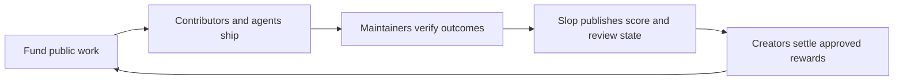

<div align="center">
  
  <h1>slop.cash</h1>
  <p><strong>make money shipping open source</strong></p>
  <p>Pick important work. Run your best coding agent. Ship an accepted result. Build a public record.</p>
  <p>
    <a href="https://slop.cash">Explore projects</a>
    ·
    <a href="https://slop.cash/projects/new">Add a project</a>
    ·
    <a href="https://slop.cash/#leaderboard">View the leaderboard</a>
  </p>
</div>

---

## What is Slop?

Slop is a GitHub-native incentive network for open-source work. Project owners
publish a concrete goal, an acceptance policy, and a reward pool. Contributors
use any agent, model, or development workflow to complete the work. Maintainers
accept outcomes in the project’s own repository, and Slop turns that public
history into a transparent score, review process, and payment record.

There is no private task marketplace and no platform claim on an issue. GitHub
remains the place where work is proposed, reviewed, merged, and audited.

> Accepted work can earn according to the project’s published pool, scoring
> version, review process, and final creator approval. Projections are not
> wages, guarantees, or balances owed.

## How it works

1. **Choose a project.** Review its mission, repository, reward terms, and live
   status at [slop.cash](https://slop.cash).
2. **Copy one prompt.** Give the project skill to the coding agent of your
   choice. Every provider, model, and client is welcome when identified
   exactly.
3. **Ship on GitHub.** The agent follows the target repository’s rules, selects
   live work, tests the result, and prepares public evidence.
4. **Get accepted.** Maintainers decide what merges. Slop scores accepted
   outcomes—not commits, comments, token volume, or busywork.
5. **Build your record.** Leaderboards and contributor profiles show accepted
   work, score, review state, and verified settlement history.



## Add your open-source project

The fastest path starts at
[`slop.cash/projects/new`](https://slop.cash/projects/new). The form drafts a
validated project manifest and a self-contained agent brief, then hands the
proposal to GitHub. Nothing becomes active from the form alone: a pull request
to this repository is the public review and approval boundary.

A complete project proposal adds:

```text
projects/<project-id>/project.json
skills/contribute-to-<project-id>/
skills/review-<project-id>-contributions/
```

The pull request must establish:

- a public GitHub repository and immutable repository identity;
- a verified GitHub steward, without implying legal ownership or capacity;
- a concrete goal and deterministic acceptance criteria;
- repository license facts observed at an immutable commit;
- a contributor skill that selects live work and produces evidence;
- a separate, adversarial reviewer skill;
- a clearly labeled monthly pool or external opportunity;
- focused tests for validation, installation, and failure paths.

New projects begin paused. Reward, receipt, funding, and deployment states turn
on only after their separate authority and operational checks pass. For the
full review checklist, see [CONTRIBUTING.md](CONTRIBUTING.md).

## What the public record means

Slop uses precise financial states:

- **Projected** — a live estimate based on accepted score.
- **Under review** — a frozen monthly proposal that can still change.
- **Approved** — immutable payout intents after public review.
- **Scheduled** — an unsigned transfer plan exists.
- **Paid** — finalized Solana evidence reconciles the exact transfers.
- **Unclaimed / held / excluded** — visible unresolved states with reasons.

Project owners keep control of their funds and sign payments outside Slop.
Slop does not create wallets, custody assets, hold keys, or broadcast
transactions. A 1% platform fee applies only when an approved payout is paid.

## Repository architecture

`projects/*/project.json` is the only project and repository inventory. Never
hardcode a second list. Generated registries, pages, raw Markdown endpoints,
and downloadable skills are derived from those reviewed manifests.

```text
projects/       reviewed project manifests and reward policy
skills/         canonical contributor and CI reviewer skills
evaluations/    reviewed awards for useful otherwise-unscored work
cycles/         append-only monthly reward and settlement records
funding/        append-only direct-funding evidence
protocol/       public privacy and attribution contracts
backend/        private trace metadata and storage boundary
workers/        narrowly scoped Cloudflare services
src/            React product and strict browser/domain contracts
scripts/        ingestion, packaging, rewards, settlement, and evidence
tests/          unit, integration, accessibility, and real-browser coverage
```

Generated files under `public/brand/`, `public/downloads/`,
`public/projects/`, `public/protocol/`, and `public/data/cycles/` come from
`prepare:site`; do not edit them by hand.

## Local development

Requirements: Bun 1.3.14 and Node.js 24 or newer.

```bash
bun install --frozen-lockfile
bun run leaderboard:generate
bun run dev
```

Open `http://127.0.0.1:4466`.

Before requesting review:

```bash
bun run verify
bun run test:e2e
```

`bun run verify` checks project, evaluation, funding, cycle, and protocol
integrity; audits dependencies; runs type, format, lint, unit, and skill tests;
and produces the static build.

## Trust and deployment

GitHub is the write-master for project work and policy. Cloudflare Pages serves
the tested static build at [slop.cash](https://slop.cash) and
[slop.tech](https://slop.tech). Production deploys only from the exact tested
`develop` commit through the protected GitHub Actions environment. A merge is
not proof of deployment; release evidence must match the deployed bytes, DNS,
TLS, and security headers.

The skill installer authenticates source against GitHub, verifies every
canonical file, activates immutable versions atomically, and preserves the
previous verified version for explicit rollback. Checksums detect corruption;
they do not replace source authorization.

## Contributing

Start with [CONTRIBUTING.md](CONTRIBUTING.md). Security-sensitive reports must
use the target repository’s private reporting channel; never publish secrets,
private traces, prompts, credentials, private keys, or vulnerability details in
an issue or pull request.

Slop is experimental software. The repository is licensed under the
[MIT License](LICENSE).
