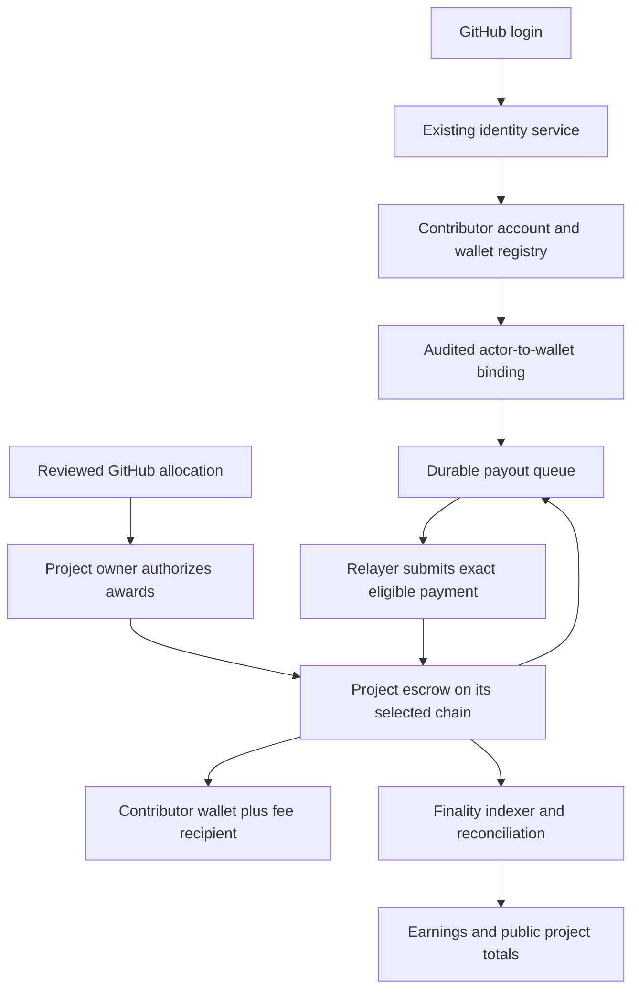

# Base and Solana payouts: architecture review and implementation plan

Date: 6 October 2026. Status: implementation authorized by the user; public-chain release evidence remains required. Updated fee instruction: deduct 2% from gross contributor allocations.

## Recommendation

Build a small, purpose-built escrow and distributor on each chain. Keep one accounting specification, one contributor account, and one settlement network per project. Use a permissionless payment operation with a sponsored relayer so registered contributors receive funds without signing each payment. Reserve approved awards on-chain even when their recipients have not registered a wallet.

Reuse the existing GitHub OAuth service, append-only wallet registry, reviewed allocation records, integer accounting, and transaction verification. Do not build a second identity system or replace historical settlement evidence.

The important change is the promise behind an unpaid award. Today an unclaimed row can be a reviewed record with no enforceable reserve. In the proposed system, a **funded award** is an immutable obligation backed by funds the project cannot withdraw. A wallet registration resolves its destination and triggers payment. A proposed award is still only a proposal.

This is a new financial protocol, not an additional chain selector. Existing promises about no signing, no broadcasting, 1% fees, funding instruments, and wallet cutoffs must change together.

## Audit basis and limits

- Local checkout: `40d43fcd7a5b994b7e83450b91c59b345d1a612f`, with 66 existing modified, deleted, or untracked paths. Those changes were preserved.
- Fetched `origin/develop`: `4c657a4737b498b43847db0c2e5202f383a9ef24`. The findings below use this newer source unless explicitly labeled local.
- Read the supplied repository instructions, local CONTRIBUTING.md and README, current upstream identity, wallet, funding, cycle, settlement, and deployment code, and relevant live GitHub issues and PR metadata.
- The current local checkout is substantially behind upstream. In particular, Base wallet registration and additional payment controls already exist upstream. Implement from a fresh current canonical branch, not this dirty checkout.
- No separate approved PRD or MVP plan was found by repository filename search. Their location was requested. This document converts the user's requirements into a proposed specification; it is not a claim that all remaining product decisions are approved.
- This was a source and architecture review. It did not run application tests, complete real GitHub login, inspect production D1, verify existing on-chain vaults, or deploy contracts. Source availability does not prove deployed availability.
- New testnet deployment and application validation are deliverables of the implementation phases below. No mainnet migration is authorized by this plan.

## Required behavior

| Requirement | Proposed acceptance rule |
|---|---|
| Base or Solana payouts | Each activated project has exactly one settlement network and its network's approved USDC asset. |
| One chain per project | Lock the choice before first funding. No runtime contributor override, automatic bridge, or concurrent second payout chain. |
| Future chains | Add a network definition and a chain adapter, then pass the same accounting and workflow conformance suite. A new execution family also needs a contract implementation. |
| On-chain escrow | A project-specific vault holds funds. The program prevents withdrawal of funds reserved for awards and their fees. |
| On-chain distribution | Each immutable obligation has a unique ID and can be discharged once. Contributor transfer and payout fee settle atomically. |
| Public totals | Derive deposited, reserved, contributor-paid, payout-fee, withdrawn, and withdrawal-fee totals from finalized chain evidence. |
| 2% contributor payout fee | Freeze fee rules with the award and collect the fee when the award is paid, not when its proposal is created. |
| 10% return of unused funds | Deduct the fee from the gross unused amount withdrawn. Reserved awards are not withdrawable. |
| GitHub-only login | Identify accounts by immutable numeric GitHub actor ID. Login names are display metadata. Wallet connection is not a login method. |
| Walletless recipient | Create an award for the actor before their first site login. Reserve the amount and fee. Show “Add a Base/Solana wallet to receive …”. |
| Registered recipient | After an award becomes funded and executable, the relayer sends it to the active verified destination automatically. |
| Registration after approval | Registration triggers all eligible unpaid obligations on that chain; it does not require another monthly cycle or award review. |
| Backend administration | Provide actor-keyed wallet administration with append-only provenance and explicit authorization. An admin action must not silently overwrite an address. |

Recommended MVP assumptions: USDC only; no swaps or bridges; one active destination per actor per network; project sponsor pays network costs; no expiry or sponsor reclamation of funded awards. These are recommendations where the user did not specify policy.

## What exists and what is missing

The source references in this table are relative to the inspected upstream SHA, not necessarily the local files.

| Area | Verified in upstream source | Reuse and required change |
|---|---|---|
| GitHub identity | `workers/identity/` implements OAuth authorization code with PKCE, state checks, numeric actor identity, one-time assertions, and replay protection. Assertions target `private-trace-api`. | Reuse the provider flow and identity verification. Add a scoped payments/browser session boundary rather than giving a payments session private-trace or operator powers. |
| Wallet storage | `migrations/0003_wallet_claim_registry.sql` establishes canonical append-only D1 claims. `0010_wallet_claim_chain.sql` adds independent `base` and `solana` lineages with same-actor, same-chain successor constraints. | Keep these claims and digests. Add settlement binding, revocation/freeze state, and the payment wakeup transaction/outbox. Avoid a second current-address table that can disagree with the lineage. |
| Wallet API | `backend/trace/handler.ts` has authenticated registration, current-wallet reads, public immutable receipts, and a restricted operator import/recovery route. | Move shared wallet handling behind an explicit payments boundary or extract shared handlers. General admin-assisted registration needs new scoped authorization and audit semantics. Existing operator import is not a general payout-address editor. |
| Wallet possession | `protocol/wallet-possession.md` and related code provide optional Solana detached-signature evidence. Off-curve destinations are valid but cannot use that proof. | This is explicitly not a payment gate today. Automatic payouts need an approved destination-binding policy, including Base and contract/multisig wallets. Do not silently reinterpret historical evidence as consent. |
| Web wallet flow | `src/WalletRegistration.tsx` and `src/lib/wallet-registration.ts` provide OAuth registration, but still validate Solana addresses. | Rework into login-first account, earnings, and per-chain wallet flows. Base API support does not establish Base UI support. |
| Project policy | `src/lib/project-schema.mjs` still requires `reward.chain === "solana"` for monthly pools. | Introduce versioned settlement configuration in the existing manifest, with one network, asset, vault identity, protocol version, and explicit authorities. |
| Fees | `src/lib/rewards.ts` uses 100 basis points for monthly payouts. Upstream external-prize policy separately uses 1000 basis points. | Introduce 200-basis-point payout and 1000-basis-point withdrawal policies for the new escrow protocol. The existing external-prize 10% field is a different policy and must not be reused as a withdrawal fee. |
| Reward preparation | Deterministic allocation, source hashes, review windows, related-party checks, monthly caps, and immutable intents already exist. | Preserve them. Separate approval of an amount from availability of a wallet. Add explicit on-chain commitment after GitHub approval. |
| Unclaimed funds | Current cycle rules freeze wallets at proposal generation and carry unclaimed rows. `funding-readiness.ts` still rejects imported carry. A 2-USDC minimum also exists. | Fund walletless obligations in their original cycle and resolve the destination later. Recommend removing the minimum for new sponsored payouts; retain legacy rules in historical verification. |
| Solana settlement | `settlement-plan.ts`, `solana-settlement.ts`, and related scripts build unsigned mainnet USDC plans and verify actual transfers. | Reuse identity, exact delta, replay, and receipt discipline. Add escrow-program instruction/account verification and test environments. |
| Base settlement | `src/lib/evm-settlement.ts` already verifies exact Base USDC transfer deltas, using `evm-funding.ts`. | Reuse as verification machinery. It is not a complete Base payout pipeline, a contract, a relayer, or a walletless-claim mechanism. Preserve actual finalized-block checks; do not reduce finality to a count of recent blocks. |
| Funding | Existing Squads and Sablier commitment readers, direct-funding records, immutable instruments, and RPC verification exist. | Preserve historical instruments and evidence. New escrow deposits must actually arrive in the new vault; an existing pledge or stream balance cannot be relabeled. |
| Execution controls | Reservations, trusted transition gates, Squads batch bindings, readiness, signer-access and execution checks exist. | Reuse allocation admission and duplicate-payment controls where applicable. They do not substitute for new on-chain obligation protection. |
| Contracts and workers | No native Slop EVM escrow contract or Solana escrow program tree was found in upstream inventory. Existing services do not implement automatic payout dispatch. | Add contract build/test/deploy tooling, limited identity attestation, durable dispatch, finality indexing, and reconciliation. |
| Deployment | The inspected workflow deploys from `develop`, provisions migrations and identity updates through GitHub Actions. | Add isolated contract/backend test environments. Coordinate with issue #534 before deciding final branch names or touching deployment configuration. |

### Related work to reuse or supersede

- [#472: Base settlement](https://github.com/SlopDotCash/slopdotcash/issues/472) proposes one network per project. A maintainer comment confirms Base/Solana claim lineages merged via #478. Its unsigned direct transfers and 1% fee do not fulfill this migration.
- [#334: Merkle distribution](https://github.com/SlopDotCash/slopdotcash/issues/334) includes useful exact-once and recipient-protection discussion. Its wallet-at-freeze requirement, contributor-paid gas, and reclaim deadline differ from the requested UX.
- [#500: project vault RFC](https://github.com/SlopDotCash/slopdotcash/issues/500) and #508–#511 cover Squads vault activation, fee exclusion, payment enablement, and windup. These PRs merged on 2026-10-08 as a separate legacy committed-instrument mode: a 2-of-3 Squads project vault, a 1% fee that the creator pays separately, no protected contributor claim against the vault, and no withdrawal fee. The project schema rejects a legacy `reward.paymentMode` of `enabled` on any project with an `escrow` policy, and a review budget can be enabled only when its pool is enabled, so the two designs never run as the same funding mode.
- #500 contains author-reported devnet transactions and test results. They were not independently replayed during this audit and do not prove the proposed new contracts.
- [#477: historical unclaimed carry](https://github.com/SlopDotCash/slopdotcash/issues/477) and [#455: direct payouts outside settlement](https://github.com/SlopDotCash/slopdotcash/issues/455) identify migration hazards. Historical source records and finalized receipts must be reconciled before any import.
- [#534: staging/production split](https://github.com/SlopDotCash/slopdotcash/issues/534) claims the deploy/DNS lever for a proposed `development` staging and `main` production split. The inspected workflow still uses `develop`. Resolve that work before contract release integration; this plan changes neither DNS nor branch policies.

## Implementation approaches

| Approach | Benefits | Missing behavior or cost | Decision |
|---|---|---|---|
| Extend unsigned direct transfers | Least new code; existing authority and verifiers fit. | No enforced escrow, no automatic claims without repeated sponsor action, no enforced fees or protected reserves. | Useful legacy path, insufficient for the target. |
| Safe/Squads treasury with automation | Mature treasury tools; owners can use multisigs. | Ordinary multisig transfers can bypass application fee and reserve rules. Giving a bot broad spending authority changes risk materially. A custom module still requires contract work. | Use multisigs for owner/governance roles, not as the escrow enforcement layer. |
| Existing stream/distributor | Less custom fund-holding code when its semantics match. | Streams do not inherently represent GitHub identity awards. Address-based Merkle leaves cannot resolve unknown future wallets without an identity binding layer. Withdrawal fee and permanent reserves still need enforcement. | Evaluate exact versions; no reviewed off-the-shelf design was found that satisfies all requirements unchanged. |
| Custom Merkle escrow | Efficient approval of large sets; compact chain state. | Proof storage/distribution, claim bitmaps, root lifecycle, reserved-sum verification, and unknown-wallet identity introduce more complexity. | A later optimization after measured gas/rent costs justify it. |
| Small per-obligation escrow | Direct states, clear reserves, easy retry and late binding; consistent behavior on both chains. | Two contract implementations and meaningful independent security review. Per-award gas/rent must be measured. | Recommended MVP. |
| Custodial service/embedded wallets | Could hide chain details. | Adds custody/vendor/recovery dependencies and often broad transaction authority; not required for GitHub login with user-owned wallets. | Not the default. |

Squads supports distinct propose, vote, and execute permissions; those are useful governance primitives, not proof of these escrow restrictions ([Squads permissions](https://docs.squads.so/main/development/reference/permissions)). Sablier's ordinary cancellation model returns unvested amounts rather than enforcing this application's fee and reward reserve model ([Sablier FAQ](https://docs.sablier.com/support/faq)). Its Solana service has also announced a shutdown, so do not choose it as a new shared Base/Solana service without addressing that lifecycle ([Sablier announcement](https://blog.sablier.com/solana-shutdown)).

## Proposed architecture



### Shared model and chain adapters

Keep project choices in `projects/<id>/project.json`. A separate network registry may define technical constants, but must not duplicate project inventory, fee recipients, or funding routes. Derive each deployment's project binding from its reviewed manifest.

Use an explicit network identity rather than an ambiguous `chain: evm`: Base mainnet and Base Sepolia have different IDs; Solana clusters require explicit genesis/network binding. Bind environment, network, token, vault/program, protocol version, project, cycle and obligation ID into every signed message and receipt.

Shared operations should be small: validate destination, inspect vault, build deposit, commit awards, bind destination, build payment, build unused-fund withdrawal, fetch receipt, verify finality, decode events, and reconcile. Keep EVM nonces/gas and Solana blockhashes/accounts inside their adapters. No generic adapter may authorize a payout or decide an award.

Version new allocation, fee, wallet-binding, obligation and settlement records. Use decimal integer strings at API/storage boundaries and integer arithmetic internally. USDC uses six decimals; bound shared amounts to the Solana-compatible integer range and test checked sums before encoding them.

### On-chain state

Base: deploy an isolated project vault from a versioned factory, using a reviewed Solidity implementation. Prefer immutable, non-proxy vaults for the first production version. Use OpenZeppelin token-transfer helpers and narrow access control; they do not constitute an audit of Slop's contract ([ERC-20 utilities](https://docs.openzeppelin.com/contracts/5.x/api/token/erc20)).

Solana: use a versioned Rust/Anchor program, project configuration and obligation accounts, and a USDC token vault controlled by a program-derived address. Validate all account owners, seeds, token program IDs, mint and destination ownership. A PDA is program-controlled authority, not a private key ([Solana PDAs](https://solana.com/docs/core/pda)).

Each vault stores its immutable project/network/asset identity, sponsor/approval authority, fee configuration, identity-binding authority, free balance, reserved principal, reserved payout fees, and paid/withdrawn counters. Each obligation binds its immutable amount, actor identity key, source allocation digest and unique ID. Store paid state durably; never close a Solana obligation in a way that permits recreation and repayment.

An award can exist without a wallet. Its stable subject identifies the numeric GitHub actor; a username rename cannot move it. A domain-separated hash of an actor ID is linkable and must not be described as anonymization. Keep OAuth data off-chain; publish only the minimal identity binding necessary for audit.

Operations:

1. `deposit`: credit the exact received approved asset; emit the source and amount.
2. `commitAwards`: project authority commits the reviewed obligations and reserves gross awards (net recipient amount plus deducted fees). Require adequate free balance. Reject duplicate IDs and source identities. An unsigned or underfunded approval is not a funded award.
3. `bindDestination`: accept an authorized, versioned actor-to-wallet binding. This changes routing, not award amount or owner approval.
4. `pay`: anyone may trigger payment, but the contract chooses the bound recipient and fixed amount. Atomically mark the obligation paid, transfer principal and fee, and update counters. A failed transfer rolls back the full operation.
5. `withdrawUnused`: only the designated project authority may return free funds to its declared refund destination; transfer the withdrawal fee atomically. Reserved principal and fees cannot leave through this path.

Bounded batches are an optimization. Commit awards in bounded chunks with individual IDs and publish partial commitment accurately. Never label a full cycle funded because one chunk succeeded. Execute payments so one invalid destination cannot indefinitely block unrelated recipients; record each successful obligation separately.

Recommended production authority: owners approve amounts with reviewed Safe/Squads or other explicitly supported signing authority; the relayer pays gas only. No arbitrary-call, unlimited-approval, reserve-sweep, or fee-free refund function. Any rescue of unrelated accidentally sent tokens must demonstrably exclude the accepted payout asset and cannot bypass fees.

Prefer versioned replacement deployments over unrestricted upgrades. A Solana upgrade authority can replace fund-controlling code, even when normal instructions are narrow. Keep test deployment upgrades explicit; decide and prove production immutability or disclose a timelocked multisig upgrade trust model before launch. Freezing upgrades sacrifices bug repair and needs its own readiness decision. Emergency controls should halt new commitments and withdrawals without confiscating existing claims; the exact payment-pause and recovery policy needs approval and testing.

### GitHub identity and destination authority

Chains cannot directly verify the application's GitHub OAuth session. Automatic routing by GitHub identity therefore needs a trusted attestation mechanism unless a different identity-proof system is deliberately introduced.

Recommended MVP: a separate, tightly scoped identity attester verifies the GitHub session and wallet registration, then certifies the binding for the target deployment. Its signing capability is separate from the relayer, owner, deployment and trace-access roles. It cannot approve award amounts or refund escrow, but a compromised attester can redirect unbound funds. This is a real trust boundary, not eliminated by calling the service non-custodial.

Binding data includes actor ID, network, destination, wallet-claim ID/digest, monotonic version, nonce, expiry and deployment domain. Attestations expire for submission; once registered on-chain, a binding persists until an authenticated successor or freeze. A persistent binding enables automatic payouts when the contributor is offline.

For ordinary wallets, require a challenge signature confirming that exact payout destination plus GitHub authentication. On Base, support contract-wallet verification only through an explicit supported path. On Solana, an off-curve address cannot sign a detached Ed25519 message; support reviewed multisig/control proof, or mark that destination pending support rather than pretending it signed. Do not invent a private key for a program address.

Admin “add wallet” should create an actor-bound pending registration with operator identity and reason; ordinary activation uses contributor confirmation. If the intended product allows an operator to activate a destination without the contributor, expose this as a separate recovery authority with documented evidence, independent review, delay and audit. It is capable of redirecting money and cannot be presented as routine metadata editing.

A wallet change appends history. The on-chain binding version orders changes and payment execution. A payment finalized before a change belongs to the old destination and is never replayed. A change finalized first invalidates a transaction's stale expected binding. Explain that a pending change is not active until finalized. Existing bound-wallet rotation should require old-wallet authorization plus GitHub authentication; lost-wallet recovery needs a reviewed delayed path. Freeze triggers and recovery cannot erase obligations.

Application changes are necessary to the current “Slop never signs or broadcasts” promise. The new service signs identity attestations and submits sponsored transactions; it does not receive users' wallet private keys. Document the actual powers of each signer without claiming that lack of custody removes all trust.

### Backend, dispatch and reconciliation

Reuse the append-only wallet registry. Add narrowly scoped tables for account/session state, approved allocation imports, obligation projections, destination-binding history, transaction attempts, finalized receipts, indexer cursors and a transactional outbox. A database row mirrors an on-chain obligation; it is not proof of funding.

Within a single database transaction, wallet activation or allocation import writes its durable event and outbox entry. Cloudflare queue delivery may repeat. An obligation ID is the idempotency key; contract state is the final double-payment guard. Lease jobs, bound concurrency, retry with backoff, and route persistent faults to operator attention while retaining the claim.

Never turn a timeout into a new payment blindly. Check the prior transaction and the on-chain obligation first. Base replacements preserve the business operation while changing transaction fees. Solana blockhash expiry requires rebuilding the same operation after reconciliation. Distinguish submitted, observed, finalized, reverted, expired and unknown.

The relayer has a limited gas balance and no power to substitute a recipient. Support a fallback client that can submit the same permissionless payment for an already bound destination if the relayer is unavailable. New identity bindings still depend on the identity service; document that availability limit.

Indexer state is rebuildable from deployment blocks/slots, contract accounts, canonical event records and immutable allocation/binding inputs. Uniqueness includes network plus transaction plus log/instruction identity. Check chain continuity, backfill gaps, rewind unfinalized projections after reorgs, and periodically compare D1 with finalized vault state. RPC outage produces “verification unavailable,” not a zero balance.

Public totals use contributor principal only for “Paid to contributors.” Fees, returns, reserved awards, available funds and lifetime deposits appear separately. Never add the same funds across deposit, obligation and payout events. Historical direct payments get a separate reconciled subtotal and source label; they do not become native escrow counter values.

## Fee accounting and conservation

The user confirmed that the 2% fee is **deducted from the gross contributor allocation**. A 100-USDC allocation reserves 100 USDC, pays 98 to the contributor, and pays 2 to Slop. Display contributor earnings net of this fee, with gross and fee available as separate details. The project never deposits an additional 2% for the award.

Recommended withdrawal interpretation: every return of unused principal pays 10%, even if the project previously paid other awards. Otherwise a tiny payout would exempt a large remaining refund. A gross 100-USDC withdrawal transfers 90 to the sponsor and 10 to Slop.

For the initial no-partial-payment protocol, calculate the payout fee once per immutable obligation as `floor(grossMinor * 200 / 10000)`, freeze it, and disallow splitting or recombining an approved obligation to change its fee. Rounding loses less than one micro-USDC per obligation. To prevent splitting withdrawals to evade their fee, calculate withdrawal fees from cumulative gross withdrawals: `floor((priorGross + gross) * 1000 / 10000) - floor(priorGross * 1000 / 10000)`. Use the identical formulas on both chains and in the backend. Governance must explicitly accept the sub-micro rounding policy.

For each vault, excluding separately tracked unsolicited token transfers:

```text
deposited = free + reservedPrincipal + reservedPayoutFees
          + contributorPaid + payoutFeesPaid
          + sponsorReturns + withdrawalFeesPaid

grossUnusedWithdrawal = sponsorReturn + withdrawalFee
```

Actual token balance must cover all accounted funds still in the vault. An unsolicited direct token transfer is excess, not an approved award or automatic sponsor deposit; define its recovery/accounting treatment without making it a bypass. ETH/SOL gas and Solana account rent are separate operating expenses, not hidden deductions from awards.

Worked acceptance example: deposit 1,000 USDC; commit a walletless 100-USDC gross award; reserved funds become 100 and free funds 900. Withdraw all free funds: sponsor receives 810, Slop receives 90, and the award's 100 remains protected. Register the wallet: contributor receives 98, Slop receives 2, and the vault reaches zero. All components reconcile to the original 1,000.

The application cannot prove that a project never pays its own alternate GitHub account to exploit the cheaper payout fee. Contract rules can prevent a direct refund bypass; award-review, related-party and abuse policy address disguised payouts. Do not promise a contract can infer beneficial ownership.

## Minimal user experience

Contributor with an existing wallet: no new action. An approved, funded award shows “Sending,” then “Paid” with chain and transaction evidence. The receiver does not sign a transfer.

Contributor without a wallet: sign in with GitHub; see “98 USDC ready — add a Solana wallet”; connect or enter the destination and confirm the required proof. The app registers the binding and queues eligible awards. No second claim button is required. A Base wallet does not satisfy a Solana award. Group earnings by chain and preserve each underlying project/cycle record.

An already registered user must be able to log in without starting another wallet registration. Session expiry should request GitHub login without losing their draft or inventing a pending payment. Use a payment-scoped HttpOnly browser session with CSRF protection; preserve the installed-client assertion flow for its original purpose. No email, social, or wallet-only account login is introduced.

Project owner: choose Base or Solana before activation; connect the authorized project wallet; fund the escrow; review the allocation and total cost; authorize commitment. The app shows available funds, reserved awards, paid principal and fees. Withdrawal preview shows gross withdrawal, 10% fee, net return, and the funds that must remain reserved. GitHub stewardship alone is not proof of wallet authority.

Operator: find an actor by verified numeric ID, inspect wallet history and pending obligations, prepare an assisted registration or freeze, and view job/reconciliation failures. Ordinary support controls cannot edit paid amounts, force “paid,” or drain reserves.

Keep proposed, under review, approved-awaiting-funding, funded-awaiting-wallet, ready, sending, paid, retrying, and held distinct. Do not show unfunded estimates as withdrawable balances. “Sending” can be prompt; “Paid” waits for the documented finality policy.

## Migration plan

1. Freeze an exact source SHA and inventory all active project policies, obligations, reservations, instruments, disclosures, current wallet lineages and known payment attempts. Reconcile external receipts before classifying unpaid amounts. Previously observed historical amounts are not current payment authority.
2. Publish v2 manifests, protocol and authority rules while v1 remains readable. Record the activation cycle and fee policy. Never reinterpret old 1% allocations using the new 2% rules.
3. Preserve wallet claim IDs, original digests, numeric actor identities and independent network lineages. Import existing claims as historical evidence; obtain the new binding authorization where required before enabling automatic routing.
4. Classify each legacy row: finalized paid, attempted/unknown, approved unpaid, unclaimed reviewed position, held, excluded or projected. A disclosure or score does not create an enforceable new escrow award by itself.
5. Create explicitly reviewed migration obligations only for authorized unpaid amounts. Give each an immutable origin reference and unique consumption key. Reconcile any old pending transfer, release path and reservation before activating its successor; never leave both paths payable.
6. Actually fund the new vault on its project's chosen chain. Existing Sablier/Squads funds need their own authorized release or new funding. No automatic bridging. Do not launch an existing project on Base while it still has an active payable Solana path if the one-chain promise is to hold.
7. Switch new-cycle writes at the approved boundary, stop legacy payment creation for that project, shadow-reconcile totals, then enable the relayer. Keep old records and verification endpoints readable.
8. Preserve historical external-prize shares as external records. If “all payouts” includes converting those projects to Slop-funded escrow payments, require a separately approved funding/award transition. A promised external prize cannot be materialized in escrow by changing a manifest.

Rollback means stop new commitments/dispatch, retain all obligations and receipts, and return to the last compatible application build. It never means restoring a database snapshot that forgets a payment, rewriting approved amounts, or withdrawing reserved funds. Database recovery must replay finalized chain events and durable registration history before dispatch resumes.

## Implementation phases and exit gates

| Phase | Concrete changes | Completion evidence |
|---|---|---|
| 0. Requirements and authority | Adopt PRD/MVP changes; settle fee incidence, withdrawal policy, identity/admin authority, claim lifetime, minimum amount, refund ownership and upgrade policy. Reconcile #472, #334, #500 and #534. | Approved requirement-to-acceptance matrix and exact authority/fee examples; no contradictory public promises. |
| 1. Shared protocol | Version project, award, wallet binding and settlement schemas; isolate network-specific encoding; preserve v1 readers; define accounting and message domains. | Legacy fixtures retain identical meaning; both chain encoders consume identical reviewed vectors; invalid cross-network/project replay is rejected. |
| 2. Contracts | Implement EVM factory/vault and Solana program with matching deposits, reserves, obligations, destination binding, payments, refunds, fees and counters. | Local-validator integration, accounting invariants, adversarial transaction tests, measured gas/rent and independent review. |
| 3. Identity and backend | Reuse OAuth and wallet lineages; add scoped sessions, destination authorization and administration; transactional outbox, dispatch attempts and finality indexing. | Real GitHub login and database migrations in isolated staging; concurrent registrations produce one valid successor; restart/retry cannot duplicate a payment. |
| 4. Product flows | Contributor earnings/wallet pages; project creation/funding/approval/withdrawal; operator failures and audit views. Derive data from shared policy. | Full browser flows with real staging APIs, desktop/mobile, keyboard, 200% zoom, WCAG AA and uploaded walkthrough evidence. |
| 5. Public test chains | Deploy exact reviewed builds to Base Sepolia and Solana Devnet; also run the explicit Solana Testnet compatibility pass described below. | Immutable deployments, verified source/builds, live receipts, exact balances/counters and full workflow recordings. |
| 6. Migration rehearsal | Dry-run historical inventory and exact-once import against isolated data; interrupted-send recovery; replay indexer from deployment. | Per-origin reconciliation report with zero double-payable rows and exact totals; legacy paid rows unchanged. |
| 7. Production readiness | Resolve independent review findings, signing/recovery operations, contract authorities, policies, resource limits and monitoring. Run protected release process. | Separate approval for mainnet enablement plus exact-head CI, chain deployment verification and website/backend release evidence. |

Phases 1–3 are architectural dependencies for an honest end-to-end test, not mock substitutes for phase 5. Phase 0 decisions can be prepared now; policy-dependent code should not guess them. Keep each PR bounded to a meaningful capability and its real workflow proof. No PRs or issue comments were created in this review.

Candidate implementation boundaries: shared domain under `src/lib/`; reusable wallet/account backend separated from private traces; new payout worker/queue; `contracts/evm/` and `contracts/solana/`; additional D1 migrations; checked-in testnet deployment/evidence scripts. Final paths should follow repository conventions after rebasing. Update `AGENTS.md` and `CLAUDE.md` together and keep them byte-identical.

## Test and validation plan

Use real public-chain transactions for acceptance and local validators for controlled failure injection. Mocks can test adapters in isolation but cannot prove OAuth, wallet signing, contract deployment, fund conservation or chain settlement.

| Test | Procedure and expected result |
|---|---|
| Wallet already registered | Fund a project; approve an award for a bound actor; no contributor action; exact principal and 2% fee finalize once. |
| No site account or wallet | Commit an award to a known numeric GitHub actor; funds reserve on-chain; actor later signs in and registers; original award pays without a new cycle. |
| Wrong-chain wallet | Actor has only Base address and earns Solana award; registration prompt asks for Solana; no transfer to Base or guessed address. Repeat in reverse. |
| Several projects/cycles | Add the missing wallet; all eligible obligations on that network queue exactly once, while held/unfunded/other-network rows remain unchanged. |
| Reserve protection | Commit walletless awards; attempt withdrawal of total token balance; operation cannot consume reserves. Withdraw only free balance and verify the 10% fee. |
| Fee bypass | Make a small legitimate payout, then withdraw unused funds; the unused-fund fee still applies. Split withdrawal requests; cumulative fee is unchanged. |
| Tiny amounts | Execute positive sub-2-USDC awards under the approved new policy; integer rounding and sponsored costs are exact, with no silent dust loss. |
| Payment concurrency | Submit the same obligation via two workers and a fallback client; only one succeeds and no second fee is collected. |
| Crash after submission | Terminate the worker before recording the response; restart, reconcile chain state and skip or retry the same obligation safely. |
| Blockhash/nonce failures | Expire a Solana transaction and replace a Base pending transaction; obligation ID and destination remain fixed, with one finalized payment. |
| Binding attacks | Reject altered actor, amount, address, chain, project/deployment, nonce, version, expired attestation and cross-environment replay. A compromised gas relayer cannot redirect principal. |
| Wallet rotation | Race rotation against payment; chain ordering selects exactly one valid destination. Reject stale expected binding; do not resend already paid awards. |
| GitHub identity | Rename account and preserve earnings; a new account taking the old name receives nothing. Reject expired/replayed OAuth and CSRF attempts. |
| Admin assistance | Record actor, reason, predecessor and authorization. An unprivileged actor cannot register for another user; a pending admin entry cannot trigger a payment. Exercise the approved recovery policy separately. |
| Contract-wallet support | Exercise each claimed supported Base contract-wallet and Solana multisig destination path. Unsupported proof methods receive an accurate actionable state. |
| Token/account substitution | Refuse wrong mint, wrong token program, wrong vault, destination token account with wrong owner, unexpected EVM asset, and malformed Solana accounts. |
| Transfer failure | Frozen/blocked destination or token transfer failure leaves the obligation unpaid and reserved, with no fee leak. Other recipients can continue. |
| Batch boundaries | Test maximum supported batches and one above; split safely, report partial completion, and prevent starvation behind a failing recipient. |
| Authority and upgrade | Unauthorized caller cannot commit awards or refund. Prove the deployed upgrade/owner configuration matches the manifest. Exercise planned key rotation and service outage recovery. |
| RPC/finality/indexer | Disconnect RPC, provide conflicting/stale observations, replay events, simulate local reorg and restart indexer. No false paid states, duplicate totals or missing obligations. |
| Conservation | Reconcile all vault counters, token movements, obligation records and database projections after every mixed operation sequence, including overflow boundaries. |
| Legacy migration | Include already paid direct transfers, unknown attempts, missing-wallet claims, renamed actors and held rows. Reject duplicate origin consumption and unfunded imports. |
| Environment isolation | Staging cannot read production wallets/traces, use production signers, submit to mainnet, or accept a mainnet-domain attestation. |
| Browser evidence | Login, register each network, receive, refresh/history, project approval and refund; desktop/mobile, keyboard, zoom, accessible announcements, copy feedback, downloads, valid GitHub/explorer links, no app console errors or first-party request failures. |

Contract testing here is justified by money and authorization invariants, not by coverage counts. Keep existing tests. Add stateful/fuzz invariant tests only where they exercise fund conservation or authorization sequences that browser tests cannot cover. Test actual user/system entry points for the rest.

### Canonical public-chain acceptance scenario

Run the same accounting script independently on each supported test deployment, using two actual test GitHub accounts and user-controlled test wallets:

1. Create a project with one selected network and fund it with 1,000 test USDC.
2. Commit 100 to a registered actor and 50 to an actor without that network's wallet. Reserve 150 total (147 net plus 3 fees).
3. Allow automatic payment of the first award: contributor gets 98, fee recipient gets 2; second award still reserves 50.
4. Withdraw the 850 free funds: return 765 and fee 85. Attempt to withdraw the protected 50 and prove rejection.
5. Log in as the second actor, add the correct wallet, and receive 49 automatically plus a 1-USDC fee transfer.
6. Repeat dispatch and refresh/restart all services. No extra transfer occurs.
7. Verify final totals: contributor paid 147; payout fees 3; sponsor returns 765; withdrawal fees 85; reserved and free balances zero. Total 1,000.
8. Rebuild the application projection from immutable inputs and chain evidence; it must produce the same result.

### Testnet deployment and release procedure

Use Base Sepolia (chain ID 84532) and Solana Devnet as the main public application test environments. Solana distinguishes Devnet for application development from Testnet for validator/network testing. To honor the explicit request for Solana Testnet too, include a separate Testnet deploy and smoke/compatibility run; do not silently call Devnet “Testnet.” ([Base network details](https://docs.base.org/get-started/connect-to-base), [Solana clusters](https://solana.com/docs/references/clusters))

Circle lists test USDC at:

- Base Sepolia: `0x036CbD53842c5426634e7929541eC2318f3dCF7e`.
- Solana Devnet: `4zMMC9srt5Ri5X14GAgXhaHii3GnPAEERYPJgZJDncDU`.

Circle's current address list does not list Solana Testnet USDC. Use an explicitly labeled six-decimal test mint for that compatibility run; it is not Circle USDC and cannot prove the real USDC integration. Reverify mint/address identity and dependencies at deployment time. ([Circle contract addresses](https://developers.circle.com/stablecoins/usdc-contract-addresses))

1. Resolve the approved staging branch/workflow from #534. Create isolated D1, queue, OAuth callback/app, service bindings, RPC configuration, test signer accounts and test fee destinations. No production traces, wallets or credentials in staging.
2. Pin Bun/Node, Solidity/Foundry, Rust/Solana/Anchor and lockfiles. Add approved deployment scripts to the repository. Use protected GitHub Actions for deployments; no ad hoc production CLI deploys.
3. Build and test the exact reviewed SHA. Record compiler options, source/build hashes, ABI/IDL, contract/program IDs, authority configuration, chain/genesis identity, asset, deployment transaction and initial block/slot.
4. Deploy using dedicated test-only signing facilities, never keys printed in prompts, logs or artifacts. Separate the contract deployer, identity attester and gas payer. Re-read the actual deployed authorities.
5. Verify EVM source/runtime bytecode including constructor/factory configuration; verify Solana reproducible program bytes and upgrade authority. Explorer success alone is insufficient.
6. Deploy migrations, backend, relayer/indexer and site as a compatible release. Inspect schema and service configuration readback. Run real OAuth rather than a fake identity fixture for acceptance.
7. Fund test vaults through the actual app and execute the scenario and failure cases. Preserve receipts, exact balance deltas, finality observations and browser video. Base finality distinguishes inclusion from finality; use the documented finalized policy, not a fixed sleep. ([Base finality](https://docs.base.org/specifications/transactions/transaction-finality))
8. Run a restart and outage soak with repeated queue deliveries and reconciliation. Suggested acceptance is at least 24 hours with no unexplained ledger delta, lost eligible obligation or duplicate payment; document actual latency and costs rather than inventing throughput targets.
9. Publish an evidence manifest tied to the SHA and deployments. Upload the UI explainer and test videos to the eventual PR. Do not commit captured private evidence or secrets. Verify website immutable deployment URL, deployed bytes, DNS/TLS/redirects/headers and application health separately from chain deployment.
10. Run the Solana Testnet compatibility deployment with its clearly labeled test mint, record any network unavailability as incomplete evidence, and preserve a repeatable retry procedure.

Keep the repository's required checks: frozen-lockfile install; leaderboard generation where required; project, evaluation, funding and cycle checks; typecheck; lint; format; existing tests; build; real-browser E2E; and `bun run verify`. Add contract integration and testnet workflow checks to CI. Rebase and rerun required checks at the exact final head; a previous test result does not qualify changed contracts.

## Decisions required before implementation is finalized

| Decision | Recommended default | Why it matters |
|---|---|---|
| Fee incidence (confirmed) | Deduct 2% from the gross contributor allocation. Display net earnings. | 100 gross = 98 contributor + 2 fee; reserve 100. |
| Withdrawal interpretation | Charge 10% on every withdrawal of unused funds, even after other payouts. | Avoids a trivial first-payout exemption. |
| No-wallet lifetime | Funded obligations have no expiry and cannot be reclaimed by the sponsor. | Preserves the promised later claim. |
| Admin power | Admin prepares/audits; contributor authorizes normal activation; explicit separate recovery policy. | Wallet changes can redirect money. |
| Identity attester | Separate scoped signer with disclosed routing authority and reviewed recovery. | GitHub authentication is not directly verifiable by either chain. |
| Minimum payout | Remove the existing 2-USDC floor for v2; sponsor gas/rent. | Otherwise “register and receive” has an unstated exception. Measure operating cost. |
| Chain changes | Freeze at first funding for the MVP. | Prevents liabilities on two chains under one project; future migration requires zero unresolved old paths. |
| Refund ownership | One declared sponsor/refund authority per MVP project. | Multiple depositors need an explicit refund-rights policy. Do not infer it from who can send tokens. |
| Public funding | Limit creditable deposits to the declared funding model initially; any third-party funding terms must be explicit. | An arbitrary transfer cannot establish who may reclaim principal. |
| Upgrade/emergency control | Immutable/versioned vaults where practical; explicitly decide Solana upgrade authority and narrowly bounded emergency controls. | Upgrade keys can override ordinary reserve guarantees. |
| External prizes | Preserve historical external records; adopt escrow only after actual funding and reviewed conversion. | They currently sit outside Slop settlement. |
| PRD/MVP and release branch | Obtain authoritative documents and resolve #534. | Prevents implementing against contradictory scope or deployment rules. |

## Review outcome

The reusable foundation is substantial: GitHub login, both-chain wallet storage, review and allocation machinery, and both-chain transfer verification already exist upstream. The missing core is protected on-chain obligations plus destination binding, automatic dispatch, enforced fees, and a complete dual-chain product/deployment flow.

The first useful delivery should be one full testnet vertical slice on each chain: sponsor funds, approves one registered and one walletless recipient, immediate recipient is paid, unused funds refund with 10%, late recipient registers and receives their protected balance. That demonstrates the requested product. A selector, a wallet table, or an isolated contract deployment does not.

## Source register

Repository source inspected at [4c657a4737b498b43847db0c2e5202f383a9ef24](https://github.com/SlopDotCash/slopdotcash/tree/4c657a4737b498b43847db0c2e5202f383a9ef24):

- `workers/identity/README.md`, `contracts.ts`, `persistence.ts`, `wrangler.toml`.
- `backend/trace/README.md`, `handler.ts`; migrations `0003`, `0007`, `0010`.
- `src/WalletRegistration.tsx`, `src/lib/wallet-registration.ts`, `wallets.ts`, `project-schema.mjs`, `rewards.ts`, `reward-finalization.ts`, `settlement-plan.ts`, `evm-settlement.ts`, `evm-funding.ts`, `funding-readiness.ts`.
- `cycles/README.md`, `funding/README.md`, `protocol/wallet-possession.md`, `protocol/fresh-cycle-payments.md`, `.github/workflows/deploy.yml` and repository file inventory.

Live issue/PR references and primary external technical sources are linked next to their findings. Availability and policy must be rechecked at implementation and deployment time. Source review is not a claim of audit certification, production readiness, or executed payment.
