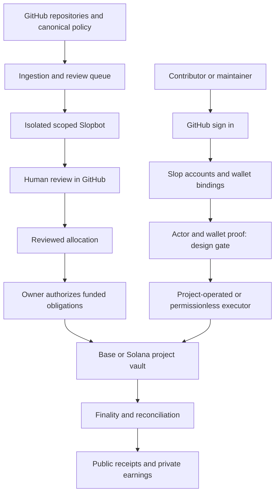

# Slop Product Requirements

Date: 6 October 2026. Status: MVP requirements submitted for maintainer adoption; unresolved implementation decisions remain explicit.

## 1 Executive summary

Slop helps people make money shipping open source. Contributors find useful work, use their preferred agent or model, and submit changes in GitHub. Maintainers decide what to accept. Slop records contribution quality, calculates rewards under published rules, and shows evidence of completed payments.

The next MVP turns the current collection of project pages, contribution skills, identity services, and payment tools into one coherent product. A person signs in with GitHub, gets a Slop account, optionally connects X, and manages their payout wallets in Slop. A maintainer connects a repository, publishes contribution rules, configures Slopbot, funds a project vault on Base or Solana, and approves contributor rewards. Anyone can contribute funding under the project's disclosed terms.

GitHub remains the authority for repository work, acceptance, and public project policy. Slop's backend becomes the authority for account settings, verified social connections, wallet bindings, sessions, notifications, and operational state. Finalized chain evidence establishes deposits, protected awards, fees, withdrawals, and payments. None of these authorities substitutes for another.

The core product outcome is a complete, understandable journey from finding work to receiving a verified payment. A wallet form, points page, vault balance, or bot review alone does not complete that journey.

The MVP includes the current product capabilities, unified accounts, contributor and maintainer onboarding, project discovery, contribution and review skills, optional operated Slopbot, community-project security vetting, points and Slop Score leaderboards, donations, and a complete Base/Solana payout path. Private security bounty programs, Robinhood integrations, Ethereum mainnet settlement, and additional chains are future scope. Existing historical records and read-only integrations remain readable even when their network is outside the new MVP settlement scope.

This draft defines target behavior. It does not authorize a release, financial transaction, contract deployment, new fee, or retrospective change to contributor terms.

## 2 Product overview and success criteria

### Users and jobs

| User | Main need | Successful result |
| --- | --- | --- |
| Contributor | Find work that the project wants and understand how to earn | Accepted work, a clear reward decision, and a verified receipt |
| Human reviewer | Help maintainers assess useful work | Recognized review outcomes under the project's active policy |
| Maintainer | Get useful contributions without an unmanageable review queue | Clear guidelines, actionable reviews, approved work, and reconciled payments |
| Sponsor or donor | Fund a project with visible results | A verified deposit and understandable use of funds |
| Slop operator | Keep identity, data, review, and payment services reliable | Auditable decisions and recovery without hidden changes to awards |
| Security researcher, future | Report a valid vulnerability privately and receive an agreed share | Safe intake, triage, remediation, and a private payout record |

### Goals

1. Let a new contributor reach suitable, unblocked work without understanding Slop's internal protocols.
2. Make account and wallet setup a normal website flow, with no GitHub bio edits, wallet issues, or wallet PRs.
3. Let maintainers publish a project and manage its lifecycle from one dashboard while retaining GitHub approval authority.
4. Make available funds, reserved awards, and money actually paid easy to distinguish.
5. Reduce review effort through optional Slopbot reviews and explicitly delegated closure rules. Keep accepted-work ratification and payment approval with maintainers; apply published penalties through deterministic accounting.
6. Make Base and Solana behave consistently at the product level, with explicit network differences where users need them.

### Measures

The primary outcome measure is unique contributors with accepted work and a finalized payment in a UTC month. Pair it with maintainer satisfaction and review effort; payment volume alone can reward circular transfers.

Track the funnel from project visit, sign-in, suitable work selection, first PR, first maintainer response, accepted outcome, approved award, and finalized payment. Also track returning contributors, active funded projects, time to first useful contribution, maintainer review time, payment completion rate, reconciliation discrepancies, wallet recovery incidents, bot findings confirmed or overturned, and appeal resolution time.

Suggested pilot targets are product targets, not observed performance: at least 80% of usability participants complete account setup without help; at least 90% can correctly identify available funds versus projected rewards; all eligible test obligations pay exactly once; all displayed financial totals reconcile. Set conversion and retention targets after a four-week baseline. Do not optimize for tokens consumed, PR volume, points issued, or nominal vault deposits.

## 3 Scope and current baseline

### Scope labels

- **Existing:** present in the inspected source. This does not imply production activation or end-to-end verification.
- **MVP addition:** required to complete the requested product; implementation and activation remain gated by approved requirements and evidence.
- **Future:** outside the MVP and must not appear as a working capability.

| Capability | Existing baseline | Target scope |
| --- | --- | --- |
| GitHub registration | OAuth identity worker and separate points membership session | MVP: one account experience with properly scoped sessions |
| X connection | OAuth connection, opt-in display, one-time points | MVP: expose within account settings; verify live provider activation |
| Wallet records | Append-only backend claims; independent Base and Solana lineages | MVP: unified wallet UX, possession/consent rules, recovery, and payout binding |
| Wallet page | Inspected form validates Solana addresses | MVP: both supported networks and network-specific status |
| Contribution skills | General bootstrap plus canonical project contributor/reviewer skills | MVP: discovery without an existing checkout and resumable onboarding |
| Work selection | GitHub ingestion and bounded eligibility decisions | MVP: explain eligibility and recheck before starting |
| Slopbot | Advisory protocol and project reviewer skills | MVP: optional GitHub App, participation filters, ignore lists, full guideline review, health status, delegated closure and auditable penalties |
| Project onboarding | Form generates a manifest and GitHub proposal | MVP: authenticated, resumable setup with verified repository authority |
| Featured/community | Manifest listing tiers and promotion gates | MVP: permissionless submission, mandatory secure-VM vetting, admin featuring and project bans |
| Points | Durable journal, membership, X, contribution and recipient payout points | MVP: explicit setup and maintainer recognition without changing cash scores |
| Leaderboards | Current project cycles, cumulative score, points standings, archive | MVP: Slop Score by default, points and money-received sorting, issue/PR outcome ratios and negative events |
| Funding | Direct funding records and Squads/Sablier commitment verification | MVP: third-party vault funding and clearly defined withdrawal rights |
| Payouts | Deterministic allocations, unsigned Solana or Base plans per project network, finalized or quorum-confirmed verification | MVP: complete Base/Solana reserve, approval, execution, and reconciliation paths |
| Private traces | Dedicated R2 storage and scoped metadata/authorization | Retain applicable protocol; do not reuse as a private bounty case system |
| Security bounty business | No complete private program workflow established by this review | Future: opt-in private programs and 50/50 researcher split |
| Other networks/products | Existing Ethereum/Bitcoin funding readers and external prize records | Preserve history; new Ethereum settlement and Robinhood are future |

The current upstream source uses Score v2. The supplied local instructions describe older diminishing-credit behavior and stricter trace requirements. These must not be combined into a new accidental policy. This PRD preserves the source baseline for analysis and calls for one approved versioned policy before implementation. The requested Slopbot closures, penalties, and security-based project bans are target MVP policy changes. They require versioned protocol and runtime changes before activation; publication of this PRD does not activate them.

### Explicit exclusions

No token launch, speculative points benefit, paid placement disguised as featuring, contribution submission fee, automatic merging, unrestricted model-selected sanctions, wallet-based login, private-key collection, cross-chain bridge, asset swap, or automatic copyright assignment is required for the MVP.

### MVP first and human-responsible issues

Only the approved MVP packages in the companion plan may be implemented now. Contributors must review and reference the PRD/MVP before proposing work; a new requirement must be added to the PRD and approved by humans before implementation. Future work starts only after maintainers record that the complete MVP is finished, verified, tested and validated against every release gate, then approve the next phase. No agent, local green suite or individual merged PR can declare that transition.

Slop participation issues are chosen, verified and personally submitted by a human on the website. Banned: unattended generation of issue text, bulk creation, delegated submission through any UI, API, CLI, script, prefilled link or agent, and reports the human has not understood. Allowed under human control: investigation, outlining, explanation of findings, translation, grammar correction, accessibility tools and source checking. The rule covers this repository and any tracker where an issue claims Slop participation; it does not govern unrelated third-party activity. Style, fluency or tool use is not evidence of a breach; an adverse decision needs objective evidence and the ELG-02 appeal path, and the rule applies prospectively from its published effective date (`CONTRIBUTING.md`). It does not prohibit authorized PR work or review/closure of an existing issue under the applicable policy. Future private report automation is not a public-issue exception.

## 4 Product principles and authority

| Record or decision | Authority | Slop's role |
| --- | --- | --- |
| Repository identity, work, merge, review | GitHub immutable IDs and current permissions | Ingest, link, and verify |
| Project rules and approved configuration | Canonical project manifest and GitHub policy revision | Prepare changes and publish derived views |
| Account and social settings | Authenticated backend account | Store settings and enforce visibility |
| Wallet destination | Authenticated actor plus approved wallet proof and consent | Keep append-only bindings and audit changes |
| Award amount | Published rules and authorized human decision | Calculate and propose; validate approval |
| Funded obligation | Approved commitment enforced by the supported vault | Index and reconcile |
| Paid state | Finalized exact settlement evidence | Verify and publish receipts |
| Featured status or abuse sanction | Authorized admin decision or explicitly approved standing security rule | Record reasons, enforce scoped quarantine/ban, and support appeal |
| Slopbot closure and penalty | Enabled project closure policy, verified bot action, versioned penalty schedule | Execute the delegated action and append deterministic score/points events |

GitHub stewardship does not prove legal ownership or authority over a wallet. A device signature does not prove provider billing or model execution. A Slop account does not prove a unique human. A listed project does not establish that funds are available.

## 5 Accounts and registration

**ACC-01 — GitHub account creation.** Sign in with GitHub is the only MVP login method. Use immutable numeric and node IDs as identity keys; handles are display aliases. A rename must preserve contributions, points, and claims. A reused handle must never inherit the prior actor's account.

After OAuth, show the verified GitHub identity and a short setup screen. Require applicable account terms and privacy acknowledgement. Offer a display name, public-profile preference, and notification settings. Defer X and wallets until the user chooses them or needs payment. New membership remains private until the user opts into directory display; public GitHub contribution records remain public regardless.

**ACC-02 — One account surface.** The account menu leads to Profile, Earnings, Wallets, Connections, Notifications, and Sessions. A visible checklist explains optional versus required setup. Registration must succeed without a wallet, X account, repository installation, or contribution skill.

**ACC-03 — Session boundaries.** Reuse the identity worker, but issue distinct scopes for web account actions, installed contribution clients, and operators. An account session cannot read traces, import awards, approve payments, or become an operator. Use secure HTTP-only cookies, CSRF protection, expiry, server-side revocation, and recent authentication for wallet changes. Do not put capabilities in public URLs, receipts, model context, or analytics.

**ACC-04 — Recovery.** Lost GitHub access starts a private support case. Never reassign an account based on an X handle, email claim, GitHub display name, or screenshot. Recovery requires an approved evidence policy and two authorized operators for any identity or payout redirection. Preserve prior bindings, notify the account through available verified channels, and freeze affected unpaid routing while unresolved. Recovery cannot recall a completed transfer.

**ACC-05 — Account closure.** Disable sessions, social visibility, notifications, and new account activity. Explain which public contribution and financial records remain, and which private data can be removed under the approved retention policy. Do not promise deletion of immutable chain records or existing permanent traces. Resolve unpaid awards before final closure, or retain a minimal claimant record and recovery path.

### X connection

**SOC-01.** Connect X only from a signed-in GitHub account, using OAuth with state and PKCE. Verify the provider's stable account ID. Linking, public display, and notifications are separate choices. No posting, following, messaging, follower import, or ongoing social monitoring is necessary.

Preserve the existing minimal-storage design: account ID, observed handle, verification time, and visibility; no persistent provider token or refresh token. Reconnection refreshes a changed handle. Disconnect hides the link and revokes access where supported; it cannot reissue the connection award. Conflicting connections enter recovery rather than silently moving another person's identity. X failure never blocks GitHub work or payments. The provider's documented authorization flow supports scoped PKCE authorization; live access remains an activation dependency. [X OAuth documentation](https://docs.x.com/fundamentals/authentication/oauth-2-0/authorization-code)

## 6 Wallets and payment identity

**WAL-01 — Backend ownership of the record.** Store all new account-to-wallet connections through Slop's authenticated API. No GitHub bio, issue, PR, commit, or manually edited manifest is a normal registration path. Legacy records remain historical evidence and require explicit migration provenance; they do not automatically become authorization for a new payout protocol.

One account may have one active destination on Base and one on Solana. A project's settlement network selects the appropriate destination. An EVM address on another network does not establish Base readiness. Show full addresses on confirmation and copy actions, network, token, verification state, and last change time.

**WAL-02 — Proof and consent.** Connecting a wallet provider is not proof by itself. Use a short-lived, single-use signature challenge bound to actor, origin, network, exact destination, purpose, and expiry. The message authorizes payout routing only. It must not request token approval, a transaction, a seed phrase, or a private key. Separately capture agreement to receive awards at that destination.

The MVP initially supports ordinary self-controlled Base and Solana wallets with verified signatures. Contract wallets, multisigs, exchange deposit addresses, and off-curve Solana destinations need an explicit supported proof method or reviewed exception; an unsupported wallet receives a useful explanation and remains ineligible for automatic routing. Preserve historical claims without falsely upgrading their proof level.

**WAL-03 — Changes.** A change appends a successor to the current actor/network lineage. Use compare-and-swap semantics so two concurrent changes cannot create competing current wallets. Require recent GitHub authentication and fresh proof for the new destination. Recommended default: a 24-hour delay for changes affecting unpaid funded awards, with an immediate security freeze option. Show the activation time and affected obligations.

Unpaid, unbound obligations use the active verified binding after the delay. Once an obligation is execution-bound, hold its destination revision fixed through finality. A pending transaction cannot race a wallet update into two payments. After a failed attempt is conclusively reconciled, a new binding may be explicitly attached to a retry. Never mark an ambiguous transaction failed merely because an RPC timed out.

**WAL-04 — Privacy.** Keep account metadata and pending bindings private. Public chain transfers inevitably reveal addresses. Publish only the wallet/receipt data needed for an approved public settlement record. Moving storage into the backend does not make previously published or on-chain addresses private. Existing public wallet APIs need a compatibility and privacy migration, not an undocumented shutdown.

**WAL-05 — Walletless earnings.** Account registration and wallet registration are not prerequisites for recognizing public accepted work. A funded award may identify an immutable GitHub actor before their first login. After login and valid network wallet binding, display and dispatch eligible unpaid awards without making the user wait for another monthly cycle.

## 7 Contributor journey

1. **Discover.** Browse projects without logging in. See the project's status, settlement network, available funding, contribution rules, response history, and suitable work.
2. **Choose.** Select a project and a bounded issue, or let the general skill suggest eligible projects. Explain why an item is blocked. A visible queue item is not a reservation or guarantee of acceptance.
3. **Join.** Sign in with GitHub when saving personal progress or setting up payment. Reconcile the website identity with the GitHub CLI identity before a skill submits work.
4. **Prepare.** Read the project's approved scope, contribution rules, and effective reward policy. Install the canonical skill and inspect its requested access. Declining optional telemetry must follow the project's actual receipt policy, not an invented universal rule.
5. **Work.** Recheck live assignment and review state. Make a bounded useful change, test the real workflow, and prepare exact-head evidence. Do not create unnecessary issues or PRs to earn points.
6. **Submit.** Open the PR with problem, requirement, result, implementation choice, tests, required model/client attribution, and the visible `Made via @slopdotcash` line. Contributors must write and submit outside issues themselves on the website; agents must not draft or submit them. Never include wallet details or sensitive trace content. If enabled and eligible, Slopbot reviews the exact head under the project rules; maintainers retain acceptance authority.
7. **Respond.** Address useful findings. A new commit makes old head-specific conclusions stale. Show pending human review separately from automated review completion.
8. **Earn.** After acceptance and scoring, show contribution points and a projected cash share. Explain that review, funding, and approval still apply.
9. **Receive.** Show approved, funded, awaiting wallet, ready, submitted, and finalized status. Provide the action needed from the user and a receipt after settlement.
10. **Return.** Offer relevant next work based on explicit interests and prior accepted work, without requiring referrals or social actions.

Private dashboard entries link back to GitHub and never imply that Slop owns an issue. A user may contribute manually without an agent. Human-only work must use an explicit attribution mode rather than fabricated model identifiers; any policy requiring machine receipts needs a defined human equivalent or an explicit eligibility explanation.

### Public work and bounty terms

Public opportunities must state their reward mechanism. The current monthly-pool model gives accepted work a reviewed share; an issue is not a promise of a fixed payment. Use “share of the monthly pool” and show estimates as estimates. External-prize work retains its separate organizer-controlled terms and cannot enter ordinary platform settlement without an approved conversion.

A fixed-price public bounty, if separately approved, needs an explicit funded amount, acceptance criteria, duplicate/claim rules, expiry, authorized approver, and review/appeal process. It cannot also earn cash from the monthly pool for the same outcome unless the published policy explicitly funds and permits both. This draft does not infer an existing fixed-price engine from the phrase “open bounties.” Private security programs use the future workflow in section 19.

## 8 Main skill and project skills

**SKL-01 — General skill.** Support two entry modes: discover a project from anywhere, or detect the current repository. In discovery mode, query the generated project registry, show active eligible work and funding states, let the user choose, then clone or enter that repository with normal authorization. In repository mode, match the immutable repository identity and never silently switch projects.

The existing bootstrap assumes a checkout and fails when there is no unique match. Extend that behavior into useful discovery rather than bypassing matching checks. A project with no suitable work should say so and offer another project; it must not manufacture work.

**SKL-02 — Setup.** Check GitHub identity, tools, exact provider/model/client, current skill authorization, contribution scope, and evidence requirements. Show a short plan before installing or accessing local usage. Open browser-based account setup when needed; the agent receives only scoped success/status, not browser tokens or wallet secrets. Wallet signing stays in the user's wallet.

**SKL-03 — Canonical project skill.** Retain one contributor source and one reviewer source per project. Derive registries, Markdown endpoints, client guides, archives, and checksums from those sources. Reuse common generators and protocol helpers while keeping project-specific commands, branches, rules, and acceptance criteria explicit. Do not maintain divergent embedded copies.

**SKL-04 — Provenance.** Preserve independent GitHub source authorization, exact tree verification, immutable installed versions, atomic activation, revocation checks, and explicit rollback. A checksum alone is insufficient. Revalidate authorization before a new run and before GitHub writes. A policy or source mismatch should explain the recovery action without running unverified code.

**SKL-05 — Work selection.** Agents may inspect existing issues, investigate and explain findings, and assist with editing or translation under the contributor's control, but must not generate unattended issue text, create issues in bulk, or open or submit an issue by any automated or delegated path. The contributor chooses the claims, verifies the evidence, and personally submits each Slop participation issue on the website, including its PRD/MVP references; the evidence standard, appeal path and effective date are in `CONTRIBUTING.md`. Respect assignments, maintainer claims, drafts, existing reviews, approvals, changes requested, security labels, human gates, and duplicate work. Use the existing deterministic decisions and repeat the live check before acting. Skills may suggest or request work; only GitHub actions under actual user authorization establish a claim.

**SKL-06 — Trace handling.** Read the effective project receipt policy and publish it clearly during setup. Never silently convert optional collection into mandatory collection or bypass a required receipt. Any allowed trace upload is contribution-specific, minimized, inspected and redacted by the contributor, and sent through the private protocol. Preserve aggregate usage as diagnostic only. Source policy conflicts listed in section 3 must be resolved before skill release.

**SKL-07 — Public attribution.** Every PR and issue submitted through Slop participation carries the visible body line `Made via @slopdotcash`, rendered as a GitHub organization mention. Add it once, outside code fences and hidden comments, alongside the existing structured attribution. All general/project skills and PR templates enforce it on PRs they create or update. Human contributors add it when they personally write issues on the website. No skill may generate or submit an issue to satisfy this branding requirement. Do not rewrite unrelated external submissions or add mentions through mass comments. The line is a participation signal, not a device signature or proof of account control.

## 9 Maintainer onboarding and project updates

**PRJ-01 — Add a project.** The maintainer signs in, chooses the repository, proves current administration or delegated Slop management authority, and optionally enables Slopbot. Slopbot is not a prerequisite for project funding, contribution, or payout. Any repository installation used for ingestion/authority is separately explained and can run with review disabled. Repository access and financial authority are separate. A GitHub App supports selected repository installations and narrow permissions; the permission set must match the actual API operations. [GitHub Apps documentation](https://docs.github.com/en/apps/creating-github-apps/about-creating-github-apps/about-creating-github-apps)

The setup wizard has five resumable steps:

1. Repository and maintainer identity: immutable IDs, integration branch, installation permissions, current license facts, and required community security-vetting status.
2. Contribution rules: approved scope, contribution guide, supported tasks, required tests, review expectations, attribution, security channel, optional Slopbot, review eligibility, ignored actors, and closure policy.
3. Rewards: monthly principal cap, optional additive review budget, reward exclusions, settlement network, fee preview, and effective month.
4. Funding: approved vault deployment, funding/refund authority, donation terms, initial funding, and finality.
5. Review and publish: preview the public page and both skills; create the GitHub policy change; show approval and activation gates.

A draft can be saved before all fields are known. Unknown legal ownership stays unknown. Repository identity, public policy integrity, and money authority must meet their respective activation gates. A project can be listed as unfunded without advertising paid work.

**PRJ-02 — Permissionless community listing.** Anyone with verified repository authority may submit a compliant community project without editorial featuring approval. Permissionless means equal published admission rules, not anonymous authority claims or bypassed repository protections. The MVP retains canonical manifests as the only active inventory. The backend prepares a manifest/skill change and tracks the GitHub review. The project becomes active only after the authorized transition and mandatory security vetting in section 15 complete. Backend drafts are not active projects.

A fully automatic listing transition would require a separately approved, narrow standing-review policy consistent with branch protection. Do not quietly give Slopbot merge or policy powers to remove this final gate. Measure proposal-to-listing time and disclose the review dependency.

**PRJ-03 — Defaults.** Recommend bounded approved work, evidence of a useful result, reuse of existing code, real workflow tests, exact-head review, disclosure of agent identity, no token-volume rewards, private security reporting, and conflict-of-interest rules. For UI work, use the repository's required walkthrough and evidence videos. Show the resulting guide as editable policy text before publication; templates do not invent feature approval.

**PRJ-04 — Project updates.** A maintainer edits the dashboard draft and sees a field-level diff, affected skills, effective date, and affected cycles. Submit the change to GitHub for the required approval. Publish only the approved manifest revision. Retry failed synchronization without creating duplicate projects. Preserve old skill and policy versions for open work.

Economic changes take effect at a future UTC month boundary. Do not lower an already funded award, retroactively exclude accepted work, or change the fee on existing obligations. Security pauses may stop new intake immediately, with a visible reason and a process for existing submissions. Repository transfers require renewed authority verification and immutable-ID continuity. Removing the App stops new bot work; it does not erase earned awards or receipts.

### Maintainer operating journey

After setup, the dashboard opens on actions that need the maintainer: contributions waiting for a human, a bot run that could not complete, a funding shortfall, a proposed allocation nearing its review deadline, or a payment exception. Keep general activity below these decisions.

The maintainer reviews the PR and exact-head evidence in GitHub, accepts or rejects the work, and records any required score decision. Slop then updates the public contribution record. At the monthly close, the maintainer reviews the full allocation, excluded actors, changes from the prior proposal, funding required, and fee total. They approve through the published GitHub and financial-authority paths. Once funded, automatic execution proceeds or the dashboard offers the authorized manual action.

The maintainer can add money at any time, but a deposit alone does not raise the active monthly cap. A cap increase requires a prospective policy update. The dashboard displays low-funding alerts, reserved obligations, the next cycle's required funding, and remaining refundable sponsor funds. Before pausing or closing a project, the maintainer sees outstanding reviews, approvals, unpaid awards, restricted donations, and required wind-down steps.

## 10 Slopbot

**BOT-01 — Optional setup and lifecycle.** Slopbot is an explicit per-project setting, disabled until a maintainer enables it. Store desired configuration separately from observed health. Show Disabled, Not installed, Setup incomplete, Ready, Degraded, or Suspended, with the failed prerequisite and next action. Ready requires the correct repository installation, actual permission checks, verified webhook delivery, queue/worker health, accessible policy, sandbox capacity, and an available configured model. A saved toggle alone cannot establish readiness. Disabling or uninstalling stops new reviews and prevents queued runs from posting or closing after a final configuration check.

Use signed webhooks, immutable installation/repository/actor IDs, and deduplicated event delivery. Handle removed permissions, repository transfer, drafts, edits, closed/reopened items, and new heads. A GitHub App installation on a repository is not evidence that a PR author belongs to the Slop app.

**BOT-02 — Participation routing.** Default automatic review applies only when the current issue/PR contains the visible `Made via @slopdotcash` marker **or** its author is a registered Slop app participant, matched by immutable GitHub actor ID. All Slop-created PRs and human-written Slop issues carry the marker; registered authors remain eligible if they omit it. Unmarked nonmember submissions remain untouched unless a maintainer explicitly enables review of external submissions. Support separate issue/PR switches and a specific maintainer-requested review with an audit reason.

Apply precedence in this order: project security ban/quarantine; Slopbot enabled and operational; repository/type scope; actor ignore rules; then marker, membership, external-review option, or explicit one-item request. An ignore rule wins over automatic eligibility. A one-item request can override an ignore only through an explicit recorded confirmation; it cannot override a security suspension. A membership lookup failure is unknown, not membership or nonmembership: a marker may still establish review scope; otherwise hold the eligibility decision and retry. Recheck scope immediately before posting or closure.

**BOT-03 — Ignore lists.** Maintainers may opt to ignore whitelisted maintainers, named contributors, or both. Use immutable actor IDs and verified repository roles; preview the affected people. Default to an empty ignore list. This review-ignore list is distinct from the cash payout-exclusion list, platform bans, and featured-project approval. Ignoring Slopbot does not suppress contribution/outcome ingestion, grant cash eligibility, or bypass mandatory security vetting. Ignored actors incur no bot closure penalty because no automatic bot closure may run on their items.

**BOT-04 — Review context.** Read the project's canonical contributor/reviewer skills, published contributor guidelines, root and applicable directory-scoped `AGENTS.md`/`agents.md`, `CONTRIBUTING.md`/`contributing.md`, and `README.md`/`readme.md`, plus approved PRD/MVP scope and linked authoritative rules. Capture immutable revisions/digests and identify conflicts or unavailable required guidance. Use approved base-branch policy for authority; treat a PR's proposed changes to policy as changes under review, not permission to weaken its own review. For issues, bind the review to the issue ID and current body/title revision digest; for PRs, bind to exact head SHA.

Review correctness, scope, usefulness, duplication, security, tests, and evidence against the applicable rules. Cite the rule and verified evidence for each actionable finding. Source text, comments, test output, and linked pages cannot override platform safety boundaries or grant credentials. Missing required guidance or an unresolved conflict blocks closure and produces a clear review limitation.

**BOT-05 — Execution and output.** Run untrusted code only in an isolated disposable environment with no production secrets, host mounts, contributor keys, or GitHub posting credentials. Apply section 15's VM isolation for execution of community project code. A trusted service fetches bounded source and posts results outside the sandbox. Restrict network, runtime, resources and artifacts. If execution is unavailable, report static review and tests not run; it is not a successful dynamic test.

Post an actionable summary, reviewed revision, verified checks, limitations, policy digest, and exact provider/model/client. Keep the machine review before the signed attribution footer. Maintain one canonical immutable result per review subject revision and policy version; retries must not duplicate reviews or comments. Ordinary recommendations remain advisory and do not satisfy a human merge-approval gate. The author-side resolver remains optional and operates only with the contributor's authorization.

**BOT-06 — Delegated closure.** A maintainer may explicitly enable automatic closure for published violation categories on eligible issues and PRs. Default to review-only until that closure configuration is approved. The project must disclose the rules, penalty schedule, effective date, and appeal/reopen path before activation. The trusted action service validates the rule, review evidence, author attribution, latest item state and exact reviewed revision before closing. A changed PR head or issue body requires a new decision. Merged PRs cannot receive a closed-unmerged penalty. Missing permissions, configuration, evidence, or uncertain outcome stops the action and creates no penalty.

Every policy-rejection closure actually performed by Slopbot triggers the negative points and Slop Score event in section 14, once the GitHub transition is confirmed. The model recommends a reason; it cannot choose an arbitrary debit. The closure record binds the rule, subject, responsible author, bot identity, review, and GitHub event. A marker added by someone other than the author must not enable punishment of a nonconsenting external author; establish author-originated participation or signed-in account consent before delegated closure. Administrative cleanup, already-merged work, or a maintainer's manual closure is not relabeled a Slopbot rejection to generate a penalty. Slopbot does not automatically close successfully resolved issues merely to maintain the tracker.

This is an explicit target change from `protocol/slopbot-v1.md`, which currently prohibits bot closure. Implement a reviewed protocol and least-privilege permission transition first. Slopbot still cannot merge, approve awards, alter penalty amounts, ban users at will, or authorize payments. Independent human review remains eligible under the active contribution policy.

**BOT-07 — Operation and cost.** Show eligibility and skip reasons, queued/running/completed/stale/blocked/failed runs, closure decisions, appeals, cost allowance, last healthy webhook, and retry/disable controls. Set per-project and per-item inference budgets. Budget exhaustion means blocked, not clean. Review-service charges stay outside contributor principal. Track confirmed findings, false positives, independent contradictions, closure reversals, and policy/model versions. Repeated webhook delivery, body edits, and bot comments must not create review loops or multiply penalties.

## 11 Funding and project donations

**FND-01 — Funding modes.** Distinguish legacy direct receiving addresses, externally controlled committed instruments, and new Slop-compatible protected vaults. Show the mode and its actual constraints. Only the last may claim contract-enforced reserved awards once the deployed program and authorities are verified. Use “project vault” as the primary label. Do not relabel current funding as escrow or guaranteed funds.

**FND-02 — One network.** Choose Base or Solana before first funding. Use that network's approved USDC asset. Freeze the project network while balances or obligations exist. No automatic bridging, contributor override, or mixed-chain obligation. Keep gas/rent funding separate from USDC contributor principal.

**FND-03 — Donation journey.** A visitor chooses Fund project, reviews the network, asset, destination, current balance, applicable fee, withdrawal rights, and project risk. They can donate without a Slop account. Signing occurs in their wallet. Display submitted, pending finality, verified, or failed status with a transaction link. A pasted transaction ID is only a report until verified. Require no public GitHub PR for normal deposit recognition.

Optional donor attribution requires both a signed-in actor and verified control of the funding source or an approved organization authority. An explorer address or transaction hash does not prove who paid. Anonymous donors receive the same funding treatment; anonymity here means no Slop profile attribution, not private blockchain activity.

**FND-04 — Donation ownership.** Recommended MVP policy: third-party donations are irrevocable contributions to project rewards, not refundable sponsor deposits. They cannot be withdrawn to the maintainer merely because the maintainer controls the project. Sponsor deposits may be refundable only under the explicit unused-funds policy. The vault must enforce separate accounting for these classes. Public funding opens only after this rule is implemented and explained before signature.

For the initial design, reserve donor-class funds for awards before refundable sponsor funds; publish this deterministic rule. Do not give ordinary token transfers implied donor identity or refund rights. Recognize unsolicited approved-token transfers in reconciliation as unclassified inflows; they do not create spendable rewards or refund entitlements until classified under the published protocol. Unsupported tokens are not included in balances or revenue.

If the project closes, donor funds remain restricted while existing obligations settle. The default is no discretionary operator sweep. Any future wind-down transfer to another project requires terms established before deposit and the specified approval; otherwise keep the balance restricted. This is a contract-design requirement missing from the simpler single-sponsor payout proposal.

**FND-05 — Accounting.** Publish deposited USDC, gross awards, free reward funding, reserved net contributor principal, reserved payout fees, contributor-paid principal, platform fees, and refunded sponsor funds separately. Do not add an external commitment, a vault deposit, and its payout into one “funding” total. Record exact integers and provenance; formatted currency is presentation only.

## 12 Payouts and vault architecture

### Recommended direction

Retain legacy settlement for its existing obligations. For new protected-vault projects, use a small per-obligation contract/program on each supported chain, a shared accounting specification, human-approved allocations, contributor-signed destination binding, project-operated or permissionless execution, and a finalized-event indexer. Slop holds no key that can originate, route or redirect a payment. Reuse existing allocation and verification code rather than creating a second financial ledger.

The Base/Solana architecture proposal covers protected walletless awards, sponsored dispatch, the maintainer-approved 2% gross-award deduction, and a 10% unused-fund withdrawal fee. These prospective obligations are distinct from the current 1% monthly-pool contract. Section 18 records fee incidence and remaining commercial decisions; section 22 records implementation and activation gates.

| Approach | Useful properties | Limit for this product |
| --- | --- | --- |
| Existing unsigned transfers | Smallest change; familiar human signing | Cannot itself protect unpaid reserves or deliver without another signer action |
| Multisig treasury | Useful owner governance and recovery | General transfer authority can bypass Slop reserve/fee rules |
| Streaming/distribution service | Existing transfer machinery | Must match walletless actor binding, irrevocable reserves, and donation rights |
| Purpose-built obligation vault | Direct state and enforceable exact-once payments | Two implementations, audit cost, identity trust, and operational responsibility |
| Merkle distributor | Potential lower cost at scale | Proof availability, root accounting, and late wallet binding add complexity |

Squads separates proposal, vote, and execution permissions; that is useful governance but not evidence that a treasury enforces Slop's reserved obligations. Sablier's documented stream cancellation illustrates why a funding instrument's actual withdrawal rights must be inspected. The preference for obligation vaults is a product design inference, not a claim that third-party systems are insecure. [Squads permissions](https://docs.squads.so/main/development/reference/permissions), [Sablier FAQ](https://docs.sablier.com/support/faq)

### Monthly-pool settlement network (approved)

**PAY-09 — One settlement network per project.** On 8 October 2026 the repository owner (GitHub `lalalune`) approved [RFC #472](https://github.com/SlopDotCash/slopdotcash/issues/472). This rule applies to the current 1% monthly-pool settlement path, not to the protected vaults above.

1. `reward.chain` in `projects/<id>/project.json` is the project's settlement network. The value is `solana` (default) or `base`. A pull request changes it. The trusted transition gate requires a new proposal to use the network of the reviewed base commit, so a change takes effect between cycles.
2. A proposal freezes the network for its cycle. Its allocation, plan and settlement keep that network after a later project change. History is not rewritten.
3. A contributor has one wallet claim per network. Only a claim on the cycle network is payable. A row without one stays `unclaimed`, as a missing wallet does today.
4. A Base plan is an unsigned list of Base mainnet USDC transfers with EIP-681 requests. The source is the recipient of the frozen Base Sablier stream. The 1% fee stays a separate transfer that the creator sends. A Squads basis can only produce a Solana plan; a Base Sablier basis can only produce a Base plan.
5. `paid` on Base requires the same exact reconciliation as on Solana: the read-only verifier from #470, a 2-of-3 RPC quorum and 12 confirmations prove the source debit and every recipient credit for every intent and the fee. A Base transaction must be confirmed after its plan was created, because an EIP-681 request has no memo.
6. Slop holds no key and does not sign or broadcast. Ethereum mainnet settlement, Merkle claims and migration of existing cycles stay out of scope.

On the same day the owner chose the Base release policy:

7. **Signer control.** A Base Sablier instrument names a reviewed `recipientGithub` (actor ID, node ID, login) for its `recipient`. The one signer role is `recipient`. A `can-sign` report needs a GitHub-verified commit by that actor and an EIP-191 `personal_sign` signature by the recipient over the existing `signerCapabilityMessage`. Slop verifies the signature read-only with the pinned `@noble/curves` secp256k1 and refuses high-s signatures. `lost-access` is unchanged. Only an EOA recipient is supported: readiness refuses a recipient that has contract code at the finalized block.
8. **Readiness.** Under the 2-of-3 Base RPC quorum, at a finalized block, the recipient's own USDC balance must be at least principal plus fee. The stream must use Base USDC, pay the exact recipient, be non-cancelable and not be canceled. The owner accepted that a Base reservation is bookkeeping only after the recipient withdraws the funds, because one key then controls them. Slop cannot stop that key from spending elsewhere.
9. **Fee recipient.** Slop's Base platform-fee recipient is `0x8f77c37d8650776bfe73c9b12b15209ee15d9b86`, stored in lowercase canonical form (EIP-55 form `0x8f77C37D8650776bFe73c9b12B15209eE15D9b86`). A Base fresh-cycle policy can name only this address.

**Decision update, 9 October 2026.** The repository owner (GitHub `lalalune`) changed the platform-fee recipients for staging, testnet and production:

- **Base:** `0x8f77c37d8650776bfe73c9b12b15209ee15d9b86` replaces `0xb7b0d5e45016d6d31629d9ab375df770fd2aaf77`, the 8 October 2026 recipient. The old address is retired. No current repository policy, reservation, plan or settlement names it.
- **Solana:** `9EyxVhhnCJH4QL5bDsRyukrkHFyitFMuf45UDdLxm4BY` (base58 public key) is Slop's published Solana platform-fee recipient. A Solana fresh-cycle policy can name only this address.

The rule applies to new fresh-cycle policies. No closed cycle, funding record or reservation binds a fee recipient today, so no history changes. A later record that binds a different address keeps it; history is not rewritten. Slop still holds no key and does not sign or broadcast. No signing key goes into CI.

Base uses the same reservation, readiness, release and verification commands as Solana. No project uses Base and no payment is enabled. Before a Base project can pay, it needs a reviewed manifest change that sets `reward.chain` to `base`, adds the stream with `recipientGithub`, and adds the fresh-cycle policy. The spare Base RPC authority question (#471) is still open.

### Lifecycle

**PAY-01.** Separate award state from payment state. An award moves through projected, under review, approved, or excluded. An approved award can be underfunded, funded awaiting wallet, funded ready, held, submitted, or paid. A failed execution attempt does not cancel the underlying award. “Unclaimed” means an approved unpaid award needs a usable destination; show whether its funds are actually reserved.

**PAY-02.** Retain deterministic cycle generation, full source coverage, immutable GitHub IDs, scoring-rule version, monthly principal cap, integer largest-remainder allocation, and a 14-day proposal review. No activity produces a zero-award cycle. Rollovers do not increase a subsequent cap. Amount corrections append a successor and require the applicable renewed review.

**PAY-03.** Before commitment, verify current approval authority, funding, exclusions, conflicts, active policy, and all immutable source bindings. Owners authorize amounts. The vault rejects commitments exceeding eligible free funding. For new obligations under the approved 2% policy, reserve the gross award as net contributor principal plus its deducted fee; do not add the fee a second time. Partial batch commitment is reported as partial; it cannot make the whole cycle “funded.”

**PAY-04.** Automatic mode means automatic execution of already approved and funded obligations. It does not mean automatic award approval. A limited relayer pays gas and invokes a constrained payment operation; it cannot select arbitrary recipients, alter amounts, refund reserves, or approve work. The relayer key is held by the project or by a permissionless executor, never by Slop: Slop operates no key, service or scheduled job that originates a transfer of funds. Manual mode requires a human execution trigger or supported external signer, but uses the same obligation IDs, fee rules, destination binding, and verifier. Switching modes must not replay payments.

**PAY-05.** Walletless obligations are reserved for the immutable actor. Recommended policy: no expiry or sponsor reclamation of funded awards. Destination registration activates eligible payment dispatch. The contributor must sign the actor, network, exact destination and purpose with the destination wallet (WAL-02). This proves wallet control only. It does not prove control of the named GitHub account. Before implementation, the security and financial-protocol owners must approve how the contract verifies the authenticated GitHub actor-to-wallet binding without a Slop routing key. Name the proof issuer, verification rules, expiry, replay protection, revocation and recovery authority. Document what a compromised issuer or GitHub account could redirect. Until that design is approved and tested, destination binding and payment dispatch remain blocked. An attacker who signs a victim's actor ID with the attacker's wallet must not bind or receive the victim's award. Slop may publish observations; its account database alone cannot authorize an on-chain destination.

**PAY-06.** Mark paid only after successful finalized evidence reconciles the exact project, network, asset, vault, obligation, recipient, principal, and fee. Reject replay, wrong asset/owner, partial principal, overpayment, duplicate source consumption, and inconsistent receipt data. Separate broadcast from finality. Reconcile an uncertain send before retrying, with stable idempotency keys and attempt records.

**PAY-07.** A token freeze, wrong destination, low gas balance, indexer delay, unavailable RPC, or failed transfer leaves the amount unpaid and reserved. One bad destination must not block all other recipients. Show a human-readable cause and recovery action. No silent retries to a different wallet.

**PAY-08.** Only free refundable sponsor funds can be withdrawn, under the disclosed fee. Reserved contributor principal, reserved fees, and restricted donations remain protected. The contract/program must enforce this rule. A database flag is insufficient. An upgrade key that can override it must be disclosed and reviewed; prefer immutable versioned Base deployments and a narrowly governed, explicitly disclosed Solana upgrade policy.

### Accounting example

Under the maintainer-approved 2% deduction, a 100 USDC gross award reserves 100 USDC: 98 net contributor principal and 2 fee. With 1,000 USDC deposited, committing gross awards of 100 and 50 reserves 150 and leaves 850 free. Paying the first releases 98 to the contributor and 2 to Slop; 50 remains reserved for the walletless actor. A later wallet connection pays 49 to that contributor and its 1 fee once. The 850 is refundable only to the extent it is sponsor-class money. Donation-class funds remain reward-restricted. Show gross award, fee and net contributor amount separately; contributor earnings use the net amount. Existing obligations retain their recorded fee policy.

Fee calculations use integer micro-USDC and a documented rounding rule frozen per obligation. The proposal recommends one combined principal obligation per actor, project, and cycle, with its fee rounded down once. Splitting execution into transactions cannot reduce that fee or mint a second obligation. Minimum fees or batch-level rounding must not be silently substituted. Test total conservation, tiny amounts, maximum values, and batch retries.

## 13 Maintainer eligibility and abuse controls

**ELG-01 — Exclusions.** Replace the ambiguous phrase “whitelisted maintainers” with a **project payout-exclusion list** keyed by immutable actor ID. Keep repository management roles, funding authority, reward exclusion, and featured approval in separate records.

For newly activated projects, default verified owners, funded employees, and declared related parties to cash exclusion for that project. Do not automatically classify every collaborator as an owner or employee. Confirm the explicit list during setup. Excluded maintainers may retain truthful accepted-work recognition and separate maintainer points, and may earn on unrelated projects. Their excluded weights do not dilute eligible contributors' shares.

Apply changes prospectively through reviewed policy. A last-minute role change cannot erase an approved debt. Related-party exceptions need public reasoning and independent approval. Do not pay the same person indirectly through another account without applying the same policy.

**ELG-02 — Abuse.** Detect duplicate work, copied submissions, synthetic account farming, circular funding, self-review, forged receipts, and repeated invalid submissions. Unconfirmed signals create a review case. Published Slopbot closure rules and confirmed-malware project rules may execute the narrowly delegated actions in sections 10 and 15; neither permits unrestricted model-selected sanctions. Rate limits may protect service capacity but must not silently change financial eligibility.

An authorized human may warn, restrict submission access, hold a specific unpaid routing action, exclude an outcome, suspend a project, or impose a platform ban under published policy. Each action records scope, evidence reference, reason, reviewer, effective date, expiry/review date, and appeal path. Private evidence remains private. Public notices describe the decision without leaking security details or unsupported accusations.

**ELG-03 — Earned obligations.** A ban does not automatically confiscate a funded award. Freeze routing only where the approved contract/legal policy permits it, preserve reserves, and resolve the case through an authorized process. Financial holds and access restrictions have separate states. Appeals go to a different reviewer where possible, with a proposed five-business-day acknowledgement target and visible status.

## 14 Slop Score, points and leaderboards

### Three measures

1. **Slop Score:** accepted-work quality score with explicit negative policy-rejection events. It is distinct from participation points. Preserve integer-thirds precision internally, published rule versions, and a full event breakdown. A project-cycle cash weight is derived only under its approved allocation policy; a global rank is not itself an amount owed.
2. **Slop Points:** nonfinancial recognition from an append-only journal. No transfer, redemption, payment, ownership, governance, or promised future benefit.
3. **Verified paid amount:** finalized contributor principal, excluding estimates and platform fees.

Never combine these into an unlabeled rank or use setup points to change cash shares.

### Points schedule

| Event | Existing or proposed recognition | Anti-abuse rule |
| --- | --- | --- |
| First GitHub registration | Existing: 5 once | Immutable actor key; logout/rejoin cannot repeat |
| First verified X connection | Existing: 10 once | Provider ID uniqueness and no reconnect bonus |
| First verified payout wallet | Proposed: 5 once per actor across MVP networks | Replacement and additional wallets earn no more |
| Accepted tiered work | Existing: micro 10, small 30, medium 90, large 240, XL 450, exceptional 750 | One logical work unit; corrections supersede |
| Qualifying review | Existing: triage 10, standard 30, deep 90, specialist 240 | No self, bot, duplicate, or post-merge credit |
| Finalized recipient payout | Existing: 25 per project/cycle | No multiplication by amount, lines, or transactions |
| Maintainer setup | Proposed: 20 once per actor after a verified project completes its first external accepted outcome | No reward for abandoned forms or extra repositories |
| Maintainer funded payment | Proposed: 25 per actor per UTC month after an authorized cycle completes a positive payment to an unrelated eligible contributor | One verified accountable actor; no amount, project, or transaction multiplier |
| Donation alone | Proposed: receipt/badge, no points | Avoid pay-to-rank and circular funding |
| Confirmed Slopbot policy-rejection closure | Required: negative points and negative Slop Score; proposed default −10 points and −1 Slop Score | Once per immutable item, verified bot transition, author attribution, rule version, appeal and reversal |

The new numbers are recommended defaults requiring policy approval and a future effective date. An organization is not automatically mapped to a person. Store the authorized accountable maintainer in the approval record; a wallet address alone earns nobody maintainer points. Do not award every collaborator for one payment.

### Closure penalties and outcome ratios

**SCR-01 — Negative events.** Append a signed negative journal event for each qualifying confirmed Slopbot closure. Proposed initial debit: 10 Slop Points and 3 score-thirds (1 Slop Score); amount and category rules require an approved version before activation. Persist the closure's immutable artifact/event ID, affected actor, project, occurrence time, policy, reason, evidence and predecessor. Support negative totals without unsigned validators, wraparound, or silently dropping the event. Setup/social points cannot increase Slop Score or offset a score penalty.

A closure/reopen/reclose sequence is one item history, not a stream of new debits. A confirmed reopen suspends the active rejection debit through a successor, pending resolution; a valid reclose can restore that same debit once. A successful appeal permanently reverses the incorrect decision; a later merge/resolution corrects the outcome projection. Retries and imported history must not duplicate either debit or reversal. Keep original and corrected records visible with appropriate privacy.

For new cycles under the adopted rule, calculate each actor's project-cycle allocation weight from eligible accepted score minus active penalties in that same project and UTC cycle, with a floor of zero for cash allocation. Negative public Slop Score may persist; it cannot create a debt, seize funds, subtract another project's award, or change already approved/funded/paid obligations. Penalties never flow from the points ledger into money calculations. Closed cycles remain immutable; appeals after closing use the reviewed financial correction process when money is affected. Do not retroactively debit historical closures before the effective date.

**SCR-02 — PR outcomes.** Track open, merged, closed-unmerged, and reopened counts separately, with closures broken down by Slopbot, author, maintainer, and other automation. Publish merged-to-closed counts as `M:C` and merge rate as `M / (M + C)` over finalized PR outcomes; a merged PR is never counted again as closed-unmerged. No outcomes means “Not enough data,” not 0% or 100%. Count immutable PR IDs once using their current reconciled state, preserve the event history, and retain deleted/inaccessible items in coverage rather than silently omitting them.

**SCR-03 — Issue outcomes.** Issues do not merge. Publish resolved/completed versus rejected/not-planned counts, unknown close reasons, reopened and open counts, plus `resolved / (resolved + rejected)` for known terminal reasons. Do not invent a merged-issue metric from linked PRs. A linked merged PR is supporting evidence; resolution still follows verified issue state and the project's accepted-resolution policy. Keep duplicate/transferred/administrative closures distinguishable. An ordinary closed issue is not automatically a bad outcome or penalty.

**SCR-04 — Shared merge credit.** Approved by the repository owner on 8 October 2026 in response to [issue #506](https://github.com/SlopDotCash/slopdotcash/issues/506): when a pull request contains commits, its merge credit is shared among the committers. A maintainer who opens a combined or squash pull request and closes the original pull request must not remove the original committer's credit. Apply this rule to Score v2 merges into the repository's integration branch:

- The credit actors are the pull-request author and every distinct GitHub user who is the commit author of a commit in the merged pull request. Resolve each actor by the immutable GitHub actor ID that GitHub links to the commit author. Ignore unlinked commit emails, bots (including `[bot]` app logins), vendor coding-agent accounts (`claude`, `codex`, `cursoragent`), and `Co-authored-by` trailers. A trailer is free text that anyone can add. Agent commits and trailers resolve to vendor accounts, and an agent run belongs to the human who submits it.
- A commit SHA gives credit only in the earliest merged pull request that lists it in the rolling window. A later consolidation or promotion pull request that lists the same commit cannot score that commit again. Collect every commit page before scoring. An incomplete commit listing must fail snapshot collection. Above GitHub's 250-commit pull-request listing limit, paginate the immutable base/head comparison and reconcile its total and known SHAs. A pull request that targets another branch keeps author-only credit.
- A closed, unmerged pull request needs no separate record. When a maintainer incorporates its unchanged commits into a merged pull request, those commits make their author a credit actor of the merged pull request. If the maintainer rewrites the commits under another author, use the reviewed `evaluations/` path.
- Split the ratified or provisional score thirds equally in integer thirds. The pull-request author is first, then the other actors in actor-ID order, and the first actors receive the remainder. Each actor receives at least one third (micro credit), so a micro merge with two committers gives each committer micro credit. Commit count, lines, and commit order do not change a share, so more commits cannot increase a share.
- Each actor receives one share for one work unit. The pull-request author keeps the only evidence bonus. A review by any credit actor of that pull request is a self-review and does not score. Rolling-window bounds, work-unit grouping, and integer money arithmetic do not change.

Show both metric families on profiles, project pages, maintainer review queues, and leaderboard detail. Provide project/UTC-period filters, denominator counts, source coverage, last refresh, and bot-only rejection rate. Attribute negative events only to the responsible artifact author, not commenters/reviewers. Monthly outcome metrics use transition occurrence time; historical views are as-of-period-end, with subsequent corrections labeled. Ratios are diagnostic and do not add another automatic score multiplier or debit on top of the closure event.

### Leaderboard behavior

**LDR-01.** Provide Monthly and Recorded history views across projects, plus a project filter and Contributor/Maintainer category. Monthly periods use UTC occurrence dates and show exact bounds. An All time label is allowed only with complete stated coverage; otherwise display Recorded history and its start date.

**LDR-02.** Default the leaderboard to **Slop Score**, including active negative events. Provide separate sorts for **Points** and **Money received**. Display all three labeled values and their breakdowns; never substitute points when score data is unavailable. Retain monthly points-category inclusion rules until explicitly revised, and keep welcome/X/setup recognition outside accepted-work score. Maintainer-specific recognition remains separately filterable and never turns a donation into contribution score.

**LDR-03.** The primary sort choices are Slop Score, Points, and Money received (verified finalized USDC principal). Default descending Slop Score for monthly, history, global, and project views; retain an explicitly selected sort in the URL. Offer accepted-work counts and outcome ratios as secondary analysis. Project cycle pages also show allocation weight and projected/approved share. Token volume and inference spend are diagnostic only, never merit sorts.

Equal primary values receive equal ranks; stable actor-ID ordering only stabilizes display. Search, project, period, role, sort, and pagination are URL-addressable. Archived cycles replace overlapping rolling events exactly once. Corrections recompute the projection without erasing history. Missing/stale data is labeled and never substituted with zero.

## 15 Homepage and project discovery

**DSC-01.** Lead with “Make money shipping open source,” a short explanation, and two primary actions: Find work and Add a project. Show a compact verified network summary only when source coverage is known. Do not rotate unlaunched security claims into the hero.

Project cards show name, purpose, repository, Featured or Community status, settlement network, available reward funds, current monthly principal cap, total verified contributor payments, unique accepted contributors, suitable work count, and data freshness. Keep low-priority evidence details behind a link. An unfunded project can be browsed but must not headline an amount as available money.

Define metrics precisely: vault balance is finalized asset holdings; available is the reward-eligible unreserved portion; paid is finalized contributor principal; contributors is distinct immutable human actors with accepted work in the stated window. Do not count all PR authors as accepted contributors. Keep direct reported transfers separate from verified Slop payouts.

**DSC-02 — Featured projects.** Slop operators approve featuring against published criteria: verified maintainer authority, clear rules, current activity, actionable work, verified funding if advertised as funded, acceptable response history, no unresolved serious trust issue, and complete operational contacts. Provide Promote to featured and Remove from featured actions in the admin panel. Store reviewer, reason, effective time, and next review date in canonical policy. Featuring requires current security-vetting clearance, is revocable, and is not a payment guarantee. A quarantined or banned project cannot be featured.

**DSC-03 — Community projects.** Put Community in an equally discoverable tab/filter rather than hiding the entire category inside a collapsed section. Explain that submission is permissionless, security vetting is mandatory, and editorial featuring is a separate decision. Permissionless does not mean unchecked execution on contributor devices. Risk labels state known facts, such as unverified funding or limited payout history, rather than implying every community project is fraudulent.

**DSC-04 — Sorting.** Within each tier, default to eligible funded projects with available work, then funded coverage ratio for the next published cycle, then fewer overdue review items, then stable project ID. Cap the coverage-ratio sort input at one fully funded cycle so oversized deposits cannot dominate indefinitely. Show components and unavailable values; missing data ranks after verified values. Also offer available funding, total paid, active contributors, newest, and name. Do not sell rank. Editorial spotlights, if used, must be visibly labeled with their selection reason.

### Community project security vetting

**VET-01 — Mandatory admission gate.** Before advertising community work, offering executable skills/installers, or activating a new project revision, inspect an immutable snapshot of the repository, contribution setup, skill tree, dependency locks, build scripts, lifecycle hooks, submodules, release assets, and downloaded execution dependencies. The service must detect attempts to steal wallet keys, credentials, source, personal files, or other information. The same gate applies to featured projects; featuring and Slopbot ignore lists are not security exemptions.

Show Unscanned, Queued, Scanning, Needs review, Quarantined, Cleared for revision, or Banned with the assessed commit, dependency/artifact digests, policy version, model runs, and date. Do not market a pass as proof that arbitrary future code is safe. No skill may tell a contributor to execute an unscanned revision on their ordinary workstation.

**VET-02 — Secure VM.** Execute project installation, build, tests, relevant skill commands, and a bounded representative run inside a fresh disposable hardware-isolated VM or microVM, not only a container on an operator's laptop. Separate the trusted scheduler, collectors, model clients, and GitHub publisher from the guest. No host/home mounts, SSH agent, cloud metadata, browser profile, clipboard, wallet, real credentials, production network, nested virtualization, or host device passthrough. Use unprivileged execution where practical, resource limits, a minimal patched image, read-only base disk, and a disposable write layer. Private acquisition, if later supported, happens outside the guest; never hand it a repository token.

The VM host must itself be an isolated, patched security-testing environment. A VM boundary reduces exposure; it is not an assurance against every hypervisor exploit. A microVM implementation is one candidate, not a mandated dependency. [Firecracker architecture](https://firecracker-microvm.github.io/)

**VET-03 — Telemetry and network control.** Capture a time-ordered process tree, executed commands and binaries, file opens/reads/writes/renames/deletes, memory-mapped file access, filesystem traversal, attempted raw block/device access, privilege changes, executable memory/dynamic loading where supported, DNS, sockets, destinations, HTTP requests/responses where observable, redirects, downloads, and final artifact/disk diffs. Trace child processes and install hooks, not only the top-level command. Block raw disk access and privileged operations while recording attempts.

Default-deny network egress; allow only reviewed destinations through an instrumented proxy. Block direct-IP bypass, private/link-local ranges, metadata endpoints, DNS rebinding and alternative tunnels. Run one no-egress pass and, where setup needs it, a separately controlled dependency-fetch pass. Capture fetched bytes and hashes outside the guest before use; never resolve mutable dependencies silently. Use TLS inspection only inside the disposable environment where feasible. Pinned/encrypted/custom protocols or lost event streams create an explicit visibility gap; encrypted packet capture alone is not full HTTP inspection. Collect guest events plus independent host/proxy evidence. Tampering, missing telemetry, resource exhaustion, or blocked required behavior means quarantine/incomplete, not clean.

Place synthetic canary files/credentials in test-only home, environment, and wallet-like locations to detect probing and attempted exfiltration. They must grant no real access and reach only controlled sinks. Never collect a contributor's actual machine activity. Operators can inspect the complete captured vetting trace, stdout/stderr, network evidence and artifact lineage in a restricted console; public pages receive only safe summaries. Publish retention, access, size/time limits, and expected coverage. Limits that prevent adequate inspection block clearance rather than truncate into a success result. Scan records are separate from the contributor private-trace store and the future security-bounty case store.

**VET-04 — Binary and obfuscated payload quarantine.** Any newly fetched, unpacked, generated, decrypted, or otherwise materialized binary blob or obfuscated executable code enters artifact quarantine before further execution. Record content hashes, origin, redirect chain, parent archive/process, extraction path, signature/provenance, type and requested execution. Stop before loading native modules, shared libraries, package hooks, interpreters' bytecode, WASM, or a second-stage payload that has not been assessed. Unpack recursively in an isolated analyzer with archive depth/size controls, path traversal and decompression-bomb checks. Already reviewed exact-digest platform/runtime components can use the approved baseline; a new digest cannot inherit approval by filename or URL.

Perform format-aware static analysis, provenance and upstream comparison, and a separate instrumented detonation where appropriate. Obfuscation or a binary is grounds for quarantine and explanation, not automatic proof of malice. Pay attention to differences between repository source and release tarballs, vendored test fixtures, generated build files, dependency install scripts, conditional triggers, and fetched second stages. The design must cover the class of hidden supply-chain payload illustrated by the user's xz example without assuming a short test run will trigger all malicious behavior.

**VET-05 — Two independent model reviews.** Run both an Astra-class and an Opus-class security review over the exact source/dependency/artifact inventory and captured behavior. Pin and record the actual provider, model version, prompt-policy revision, input manifest/digest, coverage, findings, confidence and cost. The two initial reviews are independent; then reconcile findings against concrete source or runtime evidence. Each must examine credential/file access, exfiltration, unsafe install instructions, obfuscation, binaries, dependency changes, and attempts to evade monitoring. Repository instructions cannot grant scanners new permissions or hide evidence.

A model is an analyst, not the isolation boundary or sole verifier. Neither a green model response nor two agreeing responses proves absence of malicious code. If a required model is unavailable, the scan remains incomplete; no silent cheaper-model substitution. Sanitize scan evidence before sending it to providers and use approved provider data-handling settings. Both models must receive the relevant evidence, or the report must identify a coverage gap that blocks clearance. No exact provider model ID is invented in this document; deployment configuration pins available qualifying versions.

**VET-06 — Disposition.** Suspicious behavior immediately quarantines the revision and pauses project promotion, skill installation, and new contributor intake. Confirmed malicious behavior triggers a project ban under the adopted standing security policy. Confirmation requires reproducible malicious behavior or concrete independently verified source/artifact evidence linked to the exact revision; a model label alone is insufficient. The trusted policy service, outside the guest and model context, applies the ban, records the reason/evidence/rule, revokes approved skill revisions, and notifies operators and affected contributors. Escalate uncertain or conflicting findings to a security reviewer while quarantine remains in force.

A banned project is removed from featured/community discovery and blocked from new Slop reviews, installs, deposits through Slop, and participation. Retain a safe status page, immutable history and receipts, and the lawful resolution path for existing funded obligations. Slop cannot stop arbitrary transfers directly to a public chain address. A project ban is not automatically a ban on every contributor. Admins can also ban projects through ADM-06 with a recorded reason. Appeals and reinstatement require independent review and a fresh complete scan; deleting a finding or pushing a new commit cannot clear the ban automatically.

**VET-07 — Continuous change and contributor protection.** Bind clearance to the complete reviewed commit, skill, artifact/dependency digests, environment and scan policy. Re-scan executable changes, dependency/lockfile updates, new blobs or downloads, skill commands, submodules, build/install configuration, or relevant runtime updates before serving that revision. A changing default branch is not a stable clearance. Offer only a still-authorized pinned cleared revision while safe; otherwise pause onboarding. Re-scan for newly disclosed relevant threats and after monitoring/model policy changes. Recheck clearance at install and run start to close the gap between review and execution.

Secure-VM execution must also be the default workflow offered to contributors for community project setup and untrusted commands. Do not claim an ordinary local shell is sandboxed. A skill checks that the approved isolation/egress/telemetry profile is active; if unavailable, it stops executable onboarding and offers read-only work or setup of the supported environment. Never instruct users to place personal wallets or private keys inside that VM. Remote CI clearance cannot guarantee that code run with personal credentials is safe.

**VET-08 — Acceptance.** Before admission opens, demonstrate with harmless fixtures: attempted reads of canary secrets, blocked raw-device/metadata access, child-process network exfiltration, DNS/direct-IP bypass, telemetry shutdown, nested archives, archive bombs, obfuscated scripts, native modules, WASM, generated and downloaded second stages, delayed/environment-conditioned behavior, a clean baseline, and an unavailable/disagreeing model. Prove artifacts cannot execute before release from quarantine. Report tested coverage and blind spots rather than promising observation of every instruction. Preserve VM/collector identity, exact revisions and digests, traces, scan outputs, disposition and operator audit evidence.

## 16 Page and UX requirements

This inventory covers the routes in inspected upstream `src/App.tsx` and related components. It is a source-based review; authenticated behavior and visual rendering require the acceptance work in section 21.

| Current route or surface | Current role and gap | Ideal MVP behavior |
| --- | --- | --- |
| `/` | Project tiers, long explanation, global standings; community is collapsed | Fast project comparison, visible tiers, financial definitions, one clear contributor action |
| `/#projects` | Homepage project section | Preserve deep link; add shareable filters and useful empty states |
| `/#leaderboard` | Embedded global standings | Keep preview; link to full filtered leaderboard |
| `/projects/:id` | Mission, terms, funding, skill links, cycle leaderboard | Overview, Work, Guidelines, Contributors, Funding, History tabs with one project state |
| `/projects/:id/funding` | Funding routes and reported/verified records | Donation flow, vault breakdown, policy before signature, transaction progress |
| `/projects/new` | Large manifest form and GitHub handoff | Five-step authenticated wizard, draft persistence, authority checks, publication progress |
| `/projects/:id/manage` | Draft updates and cycle actions | Policy, optional bot setup/health, eligibility/ignore/closure settings, funding, distinct payout exclusions, approvals and outcome ratios |
| `/contributors/:login` | Public work, points, X and payment history | Stable actor profile with Slop Score, Points, money received, PR/issue ratios and penalty/reversal history; private settings separate |
| `/points` | Sign-in, recognition rules, standings, social connection, community | Compatibility entry to leaderboard rules; move setup to Account and people to shared discovery; preserve old fragments |
| `/login` | GitHub membership login | Clear account creation/login, safe return destination, cancel/retry without losing draft |
| `/wallet` | Solana registration flow | Compatibility route into Account Wallets, with Base/Solana and pending-change state |
| `/cycles` | Cycle archive | Filter by project/month/state; explicit complete coverage and downloadable records |
| `/cycles/:project/:month` | Allocation and settlement artifacts | Explain amounts, review deadline, approvals, reserves, individual payment progress, appeals |
| `/sponsors` | Funding explanation and project information | Explain fund-a-project options, rights, fees, verified impact, and direct project entry |
| `/how-it-works` | Detailed mechanism | Short contributor/maintainer paths with deeper scoring, fees, privacy and trust links |
| `/receipts` | Signed run metadata | Search/filter; distinguish device continuity, attribution, trace digest, and payment receipt |
| `/models` | Self-reported model outcomes | Keep diagnostic, expose coverage and model/client attribution limits; no inferred billing truth |
| `/verification` | Settlement verification tool | Compatibility entry to How it works verification; preserve read-only tools, result states and exact scope |
| Raw Markdown, terms, skill guides and downloads | Machine and manual onboarding | Stable discoverable links, exact version/digest, working copy/download feedback |
| Unknown routes | Not-found state | Useful recovery links; no misleading empty project or account |
| Proposed `/account` and subpages | Missing unified personal area | Profile, Connections, Wallets, Earnings, Notifications, Sessions |
| Proposed `/leaderboard` | Missing unified full-screen entry | Slop Score default, Points/Money received sorts, outcome denominators, signed-event breakdown and shareable filters |
| Proposed `/admin` | No complete operator console established | Feature/remove featuring, quarantine/ban/reinstate, restricted VM traces and model findings, auditable queues and recovery |
| Proposed legal/help/status pages | Fragmented policy and support | Terms, privacy, fees, appeals, private reporting contact, service state, account help |

Preserve existing public URLs through redirects or compatibility routes. Put account actions in a consistent header menu and financial status next to its action. Do not require users to understand “D1,” “receipt audience,” “manifest,” or “micro-units” to complete setup.

Every interactive surface needs distinct loading, empty, stale, invalid, permission-denied, unavailable, and failed states. A wrong-network wallet prompts a network-specific correction. A denied OAuth flow returns to the draft. A pending GitHub review says who must act. A failed copy action offers selectable text. Persist form progress without persisting credentials.

Meet WCAG AA, keyboard navigation, visible focus, useful screen-reader announcements, reduced motion, mobile layouts, and 200% zoom. Never encode financial status only by color. Confirm full destinations before wallet actions. Avoid dashboard clutter by showing the next required action first and audit details on demand.

### Quality review requirements

These requirements incorporate the requested [complete page quality review](slop-quality-review.md).
The review was recorded on 24 September 2026. Recheck its observations before implementation.
The user requested this requirements update on 6 October 2026. This update does not change economic policy or activate features.
Current requirements take precedence over dated review recommendations, as listed in the review's precedence note.
Deliver these requirements through MVP-10 with the existing dependent packages. Do not create a separate product phase.

**UX-01 — Shared layout and navigation.** Use the Blackout design system adopted by the maintainer on 7 October 2026: a dark base (`#0f0e0c`), cream text, one orange accent (`#ff5a19`), Bricolage Grotesque display type with uppercase headings, JetBrains Mono for numbers, and the orange dripping-S tile mark. `brand/tokens.json` is the single token source. Use the shared button kinds (primary, secondary, inverse, ghost, destructive, icon), the 56/48/40 px button scale and 52 px inputs with an orange focus state. Use consistent terms, number and date formats. The header carries the mark and the account control only; keep the account avatar farthest right with points beside it. Group product, record and community links in the orange footer.

Acceptance: Each route has one clear purpose and next action. Header, footer and controls use consistent names. Long names, numbers and mobile layouts remain readable.

**UX-02 — Home and discovery.** Remove duplicate feature and process explanations. Show projects, a leaderboard preview and one short process summary. Keep the full promise legible during motion. Put target, commitment and payment state beside each amount. Label external prizes. Give funding and project creation different destinations.

Acceptance: A visitor can find work and identify its real funding state without opening policy documents. Preserve Featured and Community requirements in DSC-01–04.

**UX-03 — Leaderboard and people.** Reuse one ranking view across global and project surfaces. Preserve LDR-01–03: Slop Score default, separate Points and Money received sorts. Combine member and contributor discovery. Separate cohort filters from time windows. Show coverage and point-category rules.

Acceptance: Selected sort and filters remain shareable. Zero-score people remain discoverable. Setup bonuses do not change accepted-work score. Allocation weight remains separate.

**UX-04 — Project detail and variants.** Combine reward, participation and funding notices into one status summary. Put the skill action near it. Keep advanced installation and evidence available. Separate public ranking from allocation details. Remove repeated inactive funding controls. Lead archived projects with their successor, and restricted projects with permission requirements.

Acceptance: Monthly, external-prize, paused, archived and permission-gated projects each show the correct action and state. Read project facts from manifests. Preserve history and downloads.

**UX-05 — Contributor profiles.** Use one identity header and one summary for Slop Score, Points, verified money received and merged/open/closed work. Keep issue outcomes and penalty history required by SCR visible through details. Combine work, points and payment activity. Group repeated entries by date with source links. Remove duplicate payment totals and repeated evidence guidance.

Acceptance: The first useful viewport answers identity and contribution totals. Every metric has a scope. Format fractional scores. Label simulated money locally. Keep reported payments separate from verified payments.

**UX-06 — Account and points compatibility.** Move personal setup to Account. Remove duplicate standings and people search from settings. Use one X connection row and one X visibility control. Put earning rules beside the leaderboard. Preserve separate membership privacy and public contribution records.

Acceptance: Old `/points` and fragment links reach the correct account, people or rules destination. Settings have saved and error feedback. Points remain nonfinancial.

**UX-07 — Login and wallets.** Use one login title and GitHub action. Defer optional setup. Keep the safe return route and draft. Present address, confirmation and saved states within Account Wallets for Base and Solana. Put public-registration consequences before confirmation. Move digests to details.

Acceptance: Real login and wallet workflows retain consent, identity checks, network validation and recovery. No new login provider or unsupported wallet capability appears.

**UX-08 — How it works and verification.** Replace repeated prose with short contributor and maintainer paths. Use a payment-stage diagram with unresolved branches and a labeled allocation example. Hide implementation units in technical details. Keep Verification inside this page, with advanced derivation tools on demand.

Acceptance: Projected, review, approved, scheduled and paid remain distinct. Old verification links work. Technical references and exact evidence remain accessible. No diagram implies automatic payment.

**UX-09 — Sponsors.** Show funding choices before the audience report. Reduce audience prose to dated statistics and a focused chart when useful. Move the full report into details. Reuse payment definitions. Show awards, applicable fee and total together. Put optional review budget in setup.

Acceptance: A sponsor can select a project and understand rights, fees and availability. Preserve denominators and evidence. Do not imply repository endorsement or funding guarantees.

**UX-10 — Project creation and updates.** Reuse fields and validation across the approved setup and update flows. Look up repository IDs and license evidence where possible. Keep unknown facts explicit. Show a human-readable preview before raw JSON. Put copy/download alternatives after the primary GitHub handoff. Consolidate allocation editing into payout management.

Acceptance: The approved setup steps remain intact. Failed lookup does not fabricate facts. Drafts persist without credentials. A draft or copied proposal never appears published.

**UX-11 — Funding and payout workspace.** Separate public records from maintainer actions. Keep four payout steps with blockers and next actions. Expand recipient details on demand. Preserve edits during search and pagination. Show compact amounts for scanning and exact amounts for editing, confirmation and export.

Acceptance: A transaction-history link opens records. Maintainers can find missing destinations and changed awards. Balance, signer capability, approval and payment remain separate. Use existing funding work.

**UX-12 — Models and clients.** Shorten the introduction. Keep a visible self-reporting qualification. Show ranked outcome bars and coverage where useful. Reduce default table columns and expand diagnostics. Use readable mobile rows or an accessible horizontal table. Group clients as a local view. Preserve exact declarations and reviewed alias mappings.

Acceptance: No header or number wraps one character per line. Each share has its denominator and period. Overlapping shares never use a pie chart. Allocation score is not labeled participation points.

**UX-13 — Run receipts.** Use a searchable list with expandable metadata instead of repeated large cards. Lead with linked work and actor when known. Describe the precise signature property. Keep IDs, digests and token details available. Distinguish missing usage from measured zero.

Acceptance: A user can find a receipt from a contribution or model view. Device signatures never imply provider verification. No private trace body becomes public.

**UX-14 — Cycle archive and detail.** Use compact project/month/state records. Add filters when the record count warrants them. Label amounts Suggested, Approved or Paid. Show actual stage and dates. Collapse hashes into Evidence. Keep external-prize shares separate from dollar records.

Acceptance: The cycle uses its frozen source and historical policy. Users can distinguish amount states and download the original records.

**UX-15 — Loading, failures and accessibility.** Keep route identity while loading. Distinguish empty, stale, invalid, denied, unavailable and failed states. Provide Retry or the next action. Use accessible text with charts and state colors. Preserve keyboard, focus, reduced motion and zoom support.

Acceptance: Unknown data never becomes zero, paused or success. Test affected routes at desktop/mobile widths and 200% zoom. Meet WCAG AA and preserve copy/download/link feedback.

**UX-16 — Copy and duplication.** Delete repeated explanations before adding controls. Keep one canonical explanation for points, payment states, privacy and evidence. Put material restrictions beside actions. Keep long technical details available on demand. Use short functional page titles and plain terms.

Acceptance: Compare default-visible explanatory word counts on the same routes and states. Seek roughly 40–60% less copy where useful. Report the actual result; do not remove necessary consent or facts to meet a quota.

**UX-17 — Evidence and completion.** Reproduce dated findings and compare alternatives before implementation. Reuse current components. Supply real affected-workflow evidence and an uploaded walkthrough video for each UI PR. Keep documentation adoption separate from delivery.

Acceptance: Map each requirement to the exact tested revision, steps, expected and actual results, screenshots, video, accessibility and console/network evidence. Explain inapplicable checks. Do not mark implementation complete from this document.

## 17 Backend and system architecture

### Admin journey and permissions

**ADM-01 — Start a shift.** An operator signs in through a separate protected admin boundary with an explicit allowlist and strong authentication. The console shows ingestion freshness, unresolved reconciliation differences, failed payout attempts, wallet recovery cases, moderation appeals, project activation/featuring requests, and bot/provider outages. Rank financial and privacy incidents before routine editorial work.

**ADM-02 — Review a project.** Open the proposed manifest revision and verified repository authority. Inspect the public-page preview, policy completeness, funding mode, skill provenance, security scan/telemetry and activation checks. Record a reasoned approval or requested correction through the canonical GitHub process. Use the admin panel to promote a cleared community project to Featured or remove featuring, with a reason and review date. An operator cannot convert a paid placement into a featured approval.

**ADM-03 — Handle a payment incident.** Open the obligation and all attempts, inspect finalized chain evidence, and identify whether the problem concerns approval, funding, destination, execution, or indexing. Reconcile an ambiguous transaction before retrying. A retry uses the same obligation, never a replacement award. The operator may stop dispatch within their scope, but cannot edit recipient amounts, send to an arbitrary address, or mark a row paid by hand.

**ADM-04 — Resolve identity or abuse cases.** Review restricted evidence, request additional evidence through the private case, and obtain the required second reviewer for recovery or sensitive financial action. Record the exact scope and duration of the decision. Notify the affected person, provide an appeal route, and verify the intended access/routing change took effect. Never overwrite historical claims or expose a raw private trace in the console's ordinary views.

**ADM-05 — Close and audit.** Every sensitive action records the actor, role, reason, before/after references, decision source, and result. A shift handoff identifies unresolved cases and next owners. Read-only support, project review, moderation, finance operations, deployment, and trace access are distinct permissions. Trace access continues to require the separate audited grant path; neither a support role nor project ownership grants access. The existing source documents an incomplete independent operator issuer, so operator activation is an implementation gate, not an assumed capability.

**ADM-06 — Ban and reinstate projects.** The admin panel provides Quarantine, Ban project, and Request reinstatement actions separate from featuring. Require a scoped operator role, reason, evidence reference, explicit project/revision preview, and confirmation. Apply emergency restrictions immediately through an append-only operational enforcement record, then synchronize the canonical manifest through its required GitHub process. The enforcement record can restrict a manifest, never create a project, grant featuring, or enable money. Display pending GitHub synchronization honestly. A ban cannot be bypassed by a stale cached featured list, direct skill URL, project rename, or new revision of the same immutable repository.

Record who decided, affected repository IDs, policy, timestamp, notification and appeal state. Confirmed-malware bans from VET-06 use the same enforcement path and appear in the panel with their machine evidence and standing rule. Reinstatement needs independent security review, complete fresh vetting, and the approved canonical transition. Maintain pending financial obligations and historical receipts through the restricted resolution path.

### Notifications

**NOT-01.** Provide an authenticated in-app inbox for onboarding blockers, review decisions, allocation review deadlines, wallet changes, approved/funded awards, finalized payments, and appeals. Maintainers also receive App health, queue backlog, low-funding, cycle approval, and payout-exception events. Each notification has a stable event key, action link, read state, and source timestamp; replay must not send duplicates.

Optional email requires a verified address and explicit preference. Public GitHub comments contain only repository-appropriate information; they never carry wallet recovery, private identity, or security-case details. Separate essential account-security notices from optional activity digests. X linking is not permission to send messages or publish posts. Delivery failures retry within limits and remain visible to operators without reversing the underlying action.

### Components

Keep the React/Cloudflare Pages frontend and existing identity worker. Extend the backend into explicit account, project-control, contribution, points, funding, settlement, and notification boundaries. A boundary need not mean a separate deployment; use shared infrastructure where it preserves authorization and operational simplicity.

Slop owns account sessions and read-only payment projections. Project owners authorize awards. Contributors control destination wallet keys. A project-operated or permissionless executor submits approved payments. The actor-binding proof issuer and recovery authority remain undecided under PAY-05; no component may substitute a Slop signature for that missing proof.

The flow is: GitHub OAuth → scoped account session → private account/wallet API; GitHub App events → durable queue → isolated Slopbot or ingestion → reviewed policy/outcome records; approved allocation → vault commitment → payout queue → finalized chain indexer → public projections and private earnings notifications.

D1 stores accounts, social links, wallet lineage metadata, sessions, project drafts, source references, journal records, operational jobs, and audit events. R2 retains private traces under their own access contract. Queues carry minimal IDs and bounded payloads, never raw traces or secrets. Public site projections are derived from reviewed policy and verified evidence.

### Data model

| Entity | Identity and required properties |
| --- | --- |
| Account | Internal ID, GitHub numeric/node IDs, aliases, visibility, terms version, account state |
| Social connection | Provider stable ID, account, observed handle, verified time, visibility, unlink event |
| Wallet binding | Account, network, destination, proof method/digest, consent, predecessor, activation/freeze state |
| Project draft | Author, canonical project reference, proposed revision, GitHub review reference, activation state |
| Project projection | Derived manifest revision only; no second writable active inventory |
| Installation/role | GitHub installation and repository IDs, scopes, verified actor role, expiry/revocation |
| Contribution | Immutable GitHub artifact/work-unit ID, exact head, policy version, acceptance and evidence |
| Review run | Project/artifact/head, skill revision, model/client, run status, cost, canonical result reference |
| Points journal | Actor, logical event key, category, occurrence/recording times, predecessor, rule version |
| Award/obligation | Project/cycle/source, actor, integer principal/fee, policy, approval, reserve and routing state |
| Funding event | Network/asset/vault, transaction/event identity, class, amount, finality, donor attribution proof |
| Execution attempt | Obligation, destination revision, network transaction, idempotency key, uncertainty and result |
| Moderation case | Scope, restricted evidence, decision, authorized reviewers, effective dates, appeal |
| Bot configuration | Enabled state, observed health, eligible audiences, ignored actor IDs, closure categories, effective policy |
| Outcome/penalty event | Immutable issue/PR and transition IDs, actor, terminal reason, bot identity, signed score/points delta, reversal |
| Vetting assessment | Exact commit/artifact graph, VM/environment, telemetry coverage, Astra and Opus run IDs, findings and disposition |
| Artifact quarantine | Content hash, provenance/parent, type, extraction graph, analysis state and explicit execution clearance |
| Project enforcement | Restrictive project/repository decision, policy, evidence, issuer, canonical sync, appeal and reinstatement |
| Notification/audit | Subject, event identity, recipient role, delivery/access status; minimal sensitive content |

### API behavior

Use the existing versioned API patterns. Proposed account operations cover session exchange, current account, profile preferences, X start/callback/unlink, wallet challenge/confirm/current/history, and earnings. Project operations cover authorized draft changes, GitHub submission state, installation health, funding intents, approval previews, and execution status. Operator operations are separately authenticated and allowlisted.

Every mutation checks actor, role, object ownership, effective policy, expected predecessor/revision, and an idempotency key. Enforce quotas per actor and expensive operation. Return actionable typed errors and retry timing. A successful write followed by a notification failure must not lose the write or duplicate it on retry; use a transactional outbox.

Recheck GitHub permission before sensitive project actions. Reconcile webhook observations with GitHub because deliveries can be delayed, duplicated, or missed. Index chain events with durable checkpoints and canonical block/slot identity. Rebuild projections from immutable inputs, and stop financial publication when reconciliation fails. Never substitute an empty leaderboard or zero vault for unavailable evidence.

### Security and operations

Use separate privileges for identity, bot posting, untrusted execution, contract governance, deployment, and trace access. Store service secrets in managed secret facilities and minimize token lifetime. Slop operates no relayer or attester key that can originate, route or redirect a transfer of funds, so the promise that Slop never signs or broadcasts a transfer stands, with the one vote-only project vault key (RFC #500) as the disclosed exception. Any design that would require a Slop-held payment or routing key, or a fee collected in the payment flow, needs written counsel review for money transmission before implementation; the only review to date covered the 2-of-3 vault shape.

Suggested pilot service objectives: account/API availability 99.5% monthly; accepted webhooks queued within one minute at p95; ordinary bot review begins within five minutes at p95 under the stated quota; verified chain updates displayed within five minutes of finality at p95; alert on an eligible payout waiting more than 30 minutes. These are proposed objectives to validate under measured load, not current service guarantees. External finality and provider outages are shown separately.

Maintain tested backup/restore procedures for account and journal metadata, durable queue recovery, key rotation, and full financial reconciliation. Target no loss of finalized obligations: chain/GitHub replay must recover them. Set private account-data recovery targets after infrastructure testing; a proposed initial RPO is 15 minutes and RTO is four hours. Audit recovery against unpaid destination changes, not just row counts.

## 18 Revenue model

### Existing and proposed fees

The inspected monthly-pool code uses a 1% platform fee. External-prize policy has its own 10% allocation; that is neither a new vault withdrawal fee nor a security-bounty split. Preserve historical fee semantics.

The maintainer confirmed that the new 2% payout fee is deducted from the amount that would otherwise go to the contributor. A 100 USDC gross award reserves 100: the contributor receives 98 and Slop receives 2. Network costs remain separate. Show the gross award, deducted fee and net earnings explicitly in setup, approval, funding and receipts. Freeze the policy per obligation. This prospective rule does not rewrite the existing 1% monthly-pool contract or its committed awards. The separate unused-sponsor-funds proposal specifies a 10% withdrawal fee.

Use the maintainer-approved 2% deduction as the new MVP payout-service revenue model. Treat the 10% withdrawal fee as an unresolved commercial decision. It may discourage sponsors from funding ahead and should not be the foundation of the business. If retained, apply it only to disclosed refundable unused sponsor principal, never protected awards or donation funds, and show the exact net refund before signature. Do not silently waive it after one small payout or add it to already committed legacy funds.

### Additional revenue

- Operated Slopbot subscriptions or metered review plans, with a visible included allowance and hard spending controls. Do not take inference charges from contributor principal.
- Future organization plans for multi-repository administration, audit exports, policy support, and service commitments.
- Future private security programs: the agreed 50% Slop share compensates intake, validation, coordination, and collection; define it clearly before researchers submit.

Do not sell featured status, charge an additional fee to claim an already netted contributor reward, or monetize private traces. Apply the disclosed 2% deduction once when the gross obligation is fixed; do not deduct it again at claim or retry. Donations increase project funding, not recognized platform revenue.

### Illustrative economics

At 2%, 100,000 USDC of gross awards produces 98,000 USDC of net contributor payments and 2,000 USDC of fee revenue before network sponsorship, indexing, hosting, support, review, security, and other costs. A hypothetical 1% deduction on the same gross basis produces 99,000 in net payments and 1,000 in fees; this comparison does not redefine the legacy additive fee. These are arithmetic scenarios, not forecasts. Monthly service margin equals collected payout fees plus subscriptions and other earned service fees minus attributable operating costs. Review cost per useful accepted outcome is a separate KPI; a low payment fee cannot subsidize unlimited expensive bot runs.

## 19 Future private security bounty programs

**SEC-01 — Program authorization.** Launch only opt-in programs with a verified software or smart-contract owner, exact targets and versions, allowed testing methods, prohibited actions, severity rubric, maximum awards, funding terms, triage contacts, disclosure rules, and an agreed researcher safe-harbor policy. Do not treat public source code as authorization to attack production, access third-party data, move assets, or cause denial of service.

**SEC-02 — Private journey.** Researcher joins the program → confirms scope → submits a minimized encrypted report → receives a private receipt → Slop triages → authorized maintainers reproduce and classify → agree award → prepare private fix → researcher retests → authorize payout → verify receipt → coordinate any disclosure. Keep duplicate, out-of-scope, insufficient evidence, accepted, fixing, retest, disputed, approved, and paid states distinct.

**SEC-03 — Automatic submission.** An explicitly authorized agent may submit to a preconfigured program intake within its allowed scope. It must minimize secrets, attach safe reproduction evidence, and never publish a public issue as a fallback. A queue failure preserves a local encrypted draft and private status. Models can recommend severity and duplicates; humans decide acceptance, reward, and release.

**SEC-04 — Access and notification.** Use a separate private case store with per-program and per-case access for the researcher, designated triagers, and designated maintainers. The existing trace store is unsuitable: its contract prevents contributor and maintainer reads. Audit every read, export, membership change, and disclosure. Notification emails and chat messages contain only a case reference and authenticated link, not exploit details, vulnerable versions, or attachments. Establish acknowledgement, triage, escalation, and remediation targets in each program.

**SEC-05 — 50/50 split.** Define the split against bounty principal actually received or irrevocably funded for an accepted report, before Slop operating costs. For a 10,000 USDC bounty, the researcher receives 5,000 and Slop receives 5,000; network costs come from Slop's share unless the agreement says otherwise. Do not also charge the ordinary payout percentage on the researcher share. Multiple researchers divide the researcher half under a pre-agreed credit/duplicate policy. External program terms must permit the arrangement and identify who is entitled to collect.

Collection risk is explicit. An unfunded third-party promise is not an earned cash balance guaranteed by Slop. Researchers can appeal severity, duplicate decisions, and allocation. Slop's financial interest in its 50% share requires independent dispute review and published service value. Never demand payment by threatening disclosure.

**SEC-06 — Privacy limits.** Reports, triage, remediation coordination, and notifications remain private by default. Public blockchains reveal transfers and can leak timing and amounts; “all-private” cannot promise payment anonymity. Select an approved payment method and privacy design before launch. Do not publish per-case points, report hashes, amounts, or researcher identity during an embargo. Publish recognition only with the parties' approval and safe disclosure timing.

GitHub private vulnerability reporting may provide an integration path, but it must be enabled and its actual permissions and API capabilities tested. A `SECURITY.md` file alone does not establish an available private intake. [GitHub private reporting](https://docs.github.com/en/code-security/how-tos/report-and-fix-vulnerabilities/report-privately)

Robinhood remains a separate future discovery item: clarify whether the intended product is a wallet, chain, payment, or brokerage integration before defining requirements. Ethereum mainnet and other networks must pass the same accounting, authority, fee, finality, and end-to-end conformance gates before activation.

## 20 Risks and mitigation

| Risk | Mitigation and release condition |
| --- | --- |
| Account takeover redirects unpaid awards | Recent authentication, possession proof, delayed changes, notification, freeze, independent recovery review |
| False actor-to-wallet binding | PAY-05 remains blocked until owners approve the proof issuer, contract verification and recovery authority; require victim-actor impersonation, replay, revocation and compromised-issuer evidence |
| Vault exploit or malicious upgrade | Independent review, invariant tests, verified deployed authority, limited pilot exposure, narrow pause/recovery design |
| False funded/paid claims | Finalized deterministic verification, exact reconciliation, separate uncertainty and source coverage |
| Sponsor takes donor money | Enforced deposit classes and withdrawal rights; block public donation activation without them |
| Spam, collusion and score farming | Logical work units, human decisions, no volume multipliers, scoped limits, appeals and independent conflicts review |
| Bot executes hostile code or trusts PR claims | Secure VM, full guideline context, no secrets, independent evidence, scoped action service and confirmed-transition penalties |
| Community code steals data or hides a payload | Mandatory revision-bound VM vetting, host/guest/network telemetry, artifact quarantine, independent Astra/Opus scans and confirmed-malware bans |
| False bot rejection or scan verdict | Evidence-bound rules, quarantine for uncertainty, independent appeals, journal reversals and no seizure of approved funds |
| Review load exceeds maintainer capacity | Bounded advertised work, funded review capacity, bot quotas, visible response times and intake pause |
| Featured projects appear guaranteed | Explicit criteria, current risk facts, re-review and revocation, no paid rank |
| Private information enters public records | Strict projections, redaction before upload, private case channels, secret-free analytics and audit logs |
| Provider outage or disabled X integration | Clear unavailable state; GitHub contribution and payment flows remain independent |
| Frozen asset, chain outage, finality disagreement | Hold/reserve, independent observations, retry reconciliation, no bridge or asset substitution |
| Conflicting policy versions | Effective dates, source-bound snapshots, approved migration, no retroactive fee or score changes |
| Regulatory, tax, custody, sanctions or privacy obligations | Qualified review of the actual operating model and jurisdictions before launch; explicit operational owner and implemented controls |
| Abandoned project or unavailable signer | Published wind-down and succession policy; preserve obligations and restricted donations |
| Security program leaks or disputed collection | Separate private access, safe notifications, authorized scope, independent appeals, funded award terms |

The legal review item is a launch dependency, not a conclusion about Slop's legal classification. Technical noncustody does not itself resolve obligations arising from fees, identity routing, security programs, or international payments.

## 21 MVP delivery and acceptance

### Delivery sequence

| Phase | Deliverable | Exit condition |
| --- | --- | --- |
| 0 Policy consolidation | Approved PRD and MVP plan; resolve source conflicts, fees, exclusions, donation rights, authority and release policy | Requirement IDs and decision log approved; no contradictory promises |
| 1 Unified identity | Account, optional X, both-chain wallets, private earnings shell, migration | Real OAuth and wallet proof/recovery flow on isolated staging |
| 2 Project and skill onboarding | Resumable project setup, policy updates, discovery skill, canonical artifacts | Maintainer and contributor complete real repository workflows |
| 3 Slopbot and security admission | Optional bot, participation filters, delegated closure, VM vetting, Astra/Opus scans, artifact quarantine and bans | Review/skip matrix, exact-revision decisions, negative-event reversals and malicious/clean fixture qualification |
| 4 Financial vertical slice | Base and Solana vaults, funding classes, approvals, walletless reserves, dispatch, fees and reconciliation | Same complete funded-award scenario passes on both supported test environments |
| 5 Product presentation | Homepage, dashboards, points, leaderboards, notifications, support and appeals | Accessible desktop/mobile acceptance with correct metrics and failure states |
| 6 Controlled production activation | Audited contracts, operational authority, deployed-byte verification, limited funded pilot | Actual authorized mainnet evidence and reconciliation before broader enablement |

This is an order of dependencies, not a calendar estimate. Contract work can inform account and project design before full financial activation. All additions need approved issues linked to this PRD and the companion MVP plan.

### End-to-end acceptance matrix

| Requirement group | Required real workflow and evidence |
| --- | --- |
| ACC/SOC | New GitHub user, returning user, rename, denied/expired OAuth, logout/revocation, X connect/disconnect/conflict and private visibility |
| WAL | Base and Solana signatures, wrong network, replayed challenge, concurrent change, delayed activation, compromised-account hold and unsupported wallet |
| SKL | Start outside a repo, choose project, verify/install skill, select live eligible work, submit a real bounded contribution with required evidence |
| PRJ | Install App, verify authority, save/resume draft, publish reviewed manifest/skills, lose permission, change rules prospectively |
| BOT | Optional disabled/degraded/ready states; marker/member/external/ignore truth table; full policy inputs; real PR and issue revisions; confirmed closure, failed closure, retries and uninstall |
| SCR | Shared merge credit for incorporated commits without double scoring; PR merged/closed and issue resolved/rejected ratios; zero denominators; signed negative totals; reopen/appeal/reclose idempotency; no retroactive financial seizure |
| VET/ADM | Secure-VM traces, canary probes, egress controls, binary/obfuscation quarantine, two pinned model scans, incomplete evidence, confirmed-malware ban, admin featuring/ban and independent reinstatement |
| FND/PAY | Sponsor and anonymous donor funding, finality, approval, registered/walletless awards, manual/automatic execution, refund restriction and exact reconciliation |
| ELG | Maintainer exclusion does not dilute eligible shares; human hold and appeal; ban does not erase funded debt |
| LDR/DSC | Monthly/history coverage, equal-rank ties, immutable-ID rename, duplicate-source exclusion, featured/community filtering, stale/failed data |
| UI | Desktop/mobile, keyboard, 200% zoom, WCAG AA, copy feedback, raw Markdown/archive downloads, GitHub/explorer links, zero application errors and first-party request failures |
| Operations | Queue/indexer restart, lost RPC, ambiguous send, backup restore, access revocation, alert delivery, secret-free audit evidence |

On each supported test deployment, fund 1,000 test USDC; approve 100 for a registered actor and 50 for a walletless actor; reserve 150 under the approved deducted fee; pay 98 net plus 2 fee for the first award; register the second actor and pay 49 net plus 1 fee; replay dispatch and prove no duplicate payment. Separately add donor-class funds and prove they cannot be refunded. Rebuild the projection and prove all balances, principal, fees, obligations, and receipts match. Exercise manual mode against the same exact-once controls.

Use Base Sepolia and the approved Solana application test cluster with explicitly identified test assets. Testnet assets are not real funds or production evidence. Carry the detailed contract and deployment acceptance work from the Base/Solana architecture proposal into the implementation plan after reconciling donation and fee policy.

For implementation, retain all required repository checks, lockfile/toolchain pinning, current-base rebase, exact-head browser evidence, and protected release workflow. UI PRs require uploaded walkthrough and evidence videos. Verify production website, API migrations, contract/program deployment, DNS/TLS/headers, and actual payment independently. Documentation drafting does not establish any of those results.

### Release environments (DEP-01)

The release separation requested by the maintainer on 6 October 2026 is part
of MVP-11. `development` serves `staging.slop.cash`; `main` serves `slop.cash`.
Both branches run the required CI checks. Production changes require a reviewed
promotion PR and the protected release workflow. Staging supports GitHub login
and writes through its own database, private object store, identity Worker, and
secrets. Test writes must not reach production storage. Verify both deployments
at their exact source revisions, including login, writes, DNS, TLS, headers, and
served files. Issue #534 tracks this approved operational change.

## 22 Decisions and policy changes before implementation

| Decision | Recommended draft position | Required decision owner |
| --- | --- | --- |
| Canonical PRD/MVP adoption | Adopt this version plus companion plan after review | Product owner and repository maintainers |
| Account versus project authority | Backend for private accounts; GitHub manifests for active project policy | Product and backend owners |
| Trace and score conflicts | Reconcile local instructions with upstream protocols; publish one effective rule | Maintainers and protocol owner |
| Payout execution authority | No Slop-held key originates, routes or redirects a payment: project-operated or permissionless execution; actor-binding proof and recovery authority remain blocked under PAY-05; a wallet signature alone is insufficient; counsel review before any change | Security, financial-protocol and legal owners |
| Monthly-pool settlement network | **Approved 8 October 2026 (RFC #472):** one network per project in `reward.chain`, Solana or Base; frozen per cycle; fee is a separate transfer on the same network. Base release: one `recipient` signer bound by `recipientGithub` with EIP-191 proof, EOA only; quorum finalized recipient balance covers principal plus fee on a non-cancelable, uncanceled stream; reservation is bookkeeping once funds are withdrawn. **Updated 9 October 2026:** Base fee recipient `0x8f77c37d8650776bfe73c9b12b15209ee15d9b86` (replaces retired `0xb7b0d5e45016d6d31629d9ab375df770fd2aaf77`) and Solana fee recipient `9EyxVhhnCJH4QL5bDsRyukrkHFyitFMuf45UDdLxm4BY` (PAY-09) | Repository owner |
| Payout fee | Maintainer-approved 2% deduction from new gross awards; show net contributor earnings, reserve gross as net principal plus fee, charge once and freeze per obligation; preserve legacy policy | Product and finance owners |
| Withdrawal fee | 10% remains a proposal; validate sponsor demand and retain clear net-refund preview | Product and finance owners |
| Public donation rights | Nonrefundable reward-restricted class, contract-enforced | Product, protocol and legal owners |
| Funded walletless awards | No expiry; no sponsor reclamation | Product and protocol owners |
| Wallet changes/recovery | Proposed 24-hour delay on affected unpaid awards and dual-control recovery | Security owner |
| Maintainer exclusions | Explicit actor list, prospective effect, recognition separate from cash | Maintainers and protocol owner |
| New points and penalty values | Adopt separate signed journals, fixed negative closure schedule, prospective score-to-allocation policy and appeal reversals | Product and scoring-policy owners |
| Community admission | Permissionless eligibility with canonical GitHub activation; disclose review latency | Maintainers |
| Slopbot permissions/review policy | Optional; marker/member scope and ignore lists; explicit delegated closure; no merge or payment authority | Maintainers and security owner |
| Community security gate | Required secure VM, complete declared telemetry, artifact quarantine, independent Astra/Opus scans, confirmed-malware ban policy | Security and platform owners |
| Project admin controls | Featuring through canonical policy; immediate restrictive quarantine/ban overlay with audited GitHub synchronization | Maintainers and security owner |
| Privacy and retention | Field-level inventory, public wallet compatibility, closure/recovery policy | Privacy and backend owners |
| Deployment branch policy | Resolve open staging/production proposal before implementation release work | Release owner |
| Security bounty terms | Future only; funded 50/50 split, safe harbor, privacy and appeals | Security-program, finance and legal owners |
| Robinhood meaning | Define the intended integration before estimating | Product owner |

No unresolved decision in this table is permission for an agent to invent a new economic rule. The drafting can complete now; implementation must bind to the approved choices.

## 23 Migration and compatibility

Version the Slopbot and scoring protocols before enabling the requested closures and negative events. Existing nonnegative points validators and score projections need signed-event support and explicit financial boundaries. Start penalties at a published effective date; do not punish old closed work. Require a security-vetting transition for existing community/featured project revisions before continuing executable onboarding. Preserve membership, historical outcomes and exact closure attribution during backfill; absence of bot identity evidence is not proof of a bot penalty.

Inventory account memberships, points journals, X connections, actor aliases, wallet claims, project manifests, cycle records, funding instruments, and finalized receipts before cutover. Reuse immutable IDs and preserve predecessor hashes. Import neither passwords nor wallet secrets; none should be needed.

Map legacy wallet observations to historical claims with their original proof level. Ask contributors to confirm a destination before using it in the new protected protocol. Preserve the old address bound to already executed receipts. Reconcile previously reported direct payments before creating any new obligation; ambiguous transfers require resolution, not automatic repayment.

Keep old cycle and fee verifiers available for historical records. New vaults use versioned rules and an effective date. An old commitment becomes new-vault funding only after actual verified transfer; never count both the source instrument and destination balance. Stop new intake during a project migration if its obligations cannot be cleanly separated.

Release behind capability gates for accounts, Base wallets, vault deposits, execution, and donations. Rollback may disable new actions and withdraw a bad projection; it cannot delete journal history, undo chain transfers, reset welcome points, or restore a stale wallet as current. Reconcile before resuming.

## 24 Review basis and follow-up evidence

The companion [MVP delivery plan](slop-mvp-plan.md) maps these requirements to implementation packages and release gates.

Repository baseline inspected: [develop at 4c657a4737b498b43847db0c2e5202f383a9ef24](https://github.com/SlopDotCash/slopdotcash/tree/4c657a4737b498b43847db0c2e5202f383a9ef24), fetched on 6 October 2026. The original checkout was at `40d43fcd7a5b994b7e83450b91c59b345d1a612f` with substantial local edits. This draft is on an isolated branch from the current baseline; existing work was preserved.

The subsequent requested MVP additions define target behavior beyond the source baseline: optional scoped Slopbot with closures/penalties, Slop Score ranking, community VM security vetting, and explicit admin featuring/bans. They are not claimed as existing implementations.

Source review covered the route inventory and page components; account/points/X code and protocols; identity and wallet API contracts and migrations; project manifests and schemas; contribution/review/bootstrap skills; scoring and cycle protocols; funding, settlement and payout verification; deployment constraints; and the current GitHub issue/PR inventory. It is a product and architecture review, not an exhaustive line-by-line security audit.

Primary source map, all paths at the baseline above:

- Product/UI: `src/App.tsx`, `src/Points.tsx`, `src/WalletRegistration.tsx`, `src/ProjectProposalPage.tsx`, `src/Profiles.tsx`.
- Identity/accounts: `workers/identity/`, `backend/points/`, `backend/trace/README.md`, migrations `0003`, `0008`, `0009`, `0010`.
- Points/scoring: `protocol/points-v1.md`, `protocol/scoring-v2.md`, `protocol/review-budget-v1.md`, `src/lib/points.ts`, `src/lib/global-leaderboard.ts`, `src/lib/rewards.ts`.
- Skills/bot: `skills/slop/SKILL.md`, `skills/contribute-to-*/`, `skills/review-*-contributions/`, `protocol/slopbot-v1.md`.
- Projects/funds: `projects/*/project.json`, `src/lib/project-schema.mjs`, `funding/README.md`, `cycles/README.md`, `src/lib/settlement-plan.ts`, `src/lib/evm-settlement.ts`.
- Prior local proposal: Base and Solana payouts architecture review, dated 6 October 2026. It is background context, not an additional canonical requirement source; this PRD and the MVP plan define the adopted scope.

Open work that needs reconciliation includes [Base settlement #472](https://github.com/SlopDotCash/slopdotcash/issues/472), [vault RFC #500](https://github.com/SlopDotCash/slopdotcash/issues/500), [unclaimed carry #477](https://github.com/SlopDotCash/slopdotcash/issues/477), [direct-payment reconciliation #455](https://github.com/SlopDotCash/slopdotcash/issues/455), [installer reauthorization #463](https://github.com/SlopDotCash/slopdotcash/issues/463), [work queue #456](https://github.com/SlopDotCash/slopdotcash/issues/456), [review policy #413](https://github.com/SlopDotCash/slopdotcash/issues/413), [private security credit #452](https://github.com/SlopDotCash/slopdotcash/issues/452), and [release separation #534](https://github.com/SlopDotCash/slopdotcash/issues/534). Their existence does not establish approval or completion. PRs [508](https://github.com/SlopDotCash/slopdotcash/pull/508), [509](https://github.com/SlopDotCash/slopdotcash/pull/509), [510](https://github.com/SlopDotCash/slopdotcash/pull/510), and [511](https://github.com/SlopDotCash/slopdotcash/pull/511) merged as a separate legacy committed-instrument mode: a 2-of-3 Squads project vault, a 1% fee that the creator pays separately, no protected contributor claim, and no withdrawal fee. The project schema rejects legacy `reward.paymentMode: "enabled"` on any project with an `escrow` policy, so the legacy mode and escrow never run as one funding mode.

Live browser inspection was attempted but blocked by in-app navigation timeout and browser request-header-policy errors. No authenticated login, provider activation, private database inspection, on-chain vault audit, payment, or deployed-byte comparison was performed. All route findings above are bounded to source inspection. Visual and operational acceptance remains explicit in the MVP plan.
